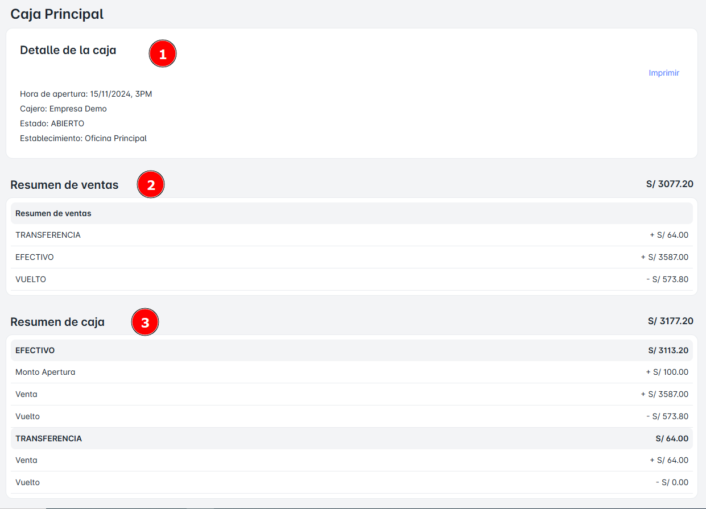
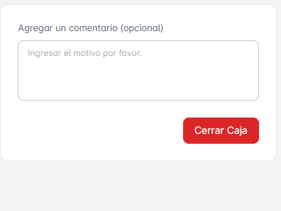
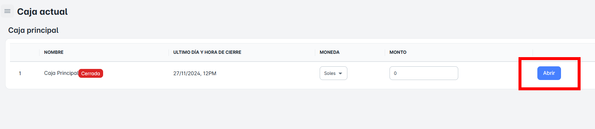

# Caja Actual

En este módulo podrás acceder a toda la información relacionada con la caja actual, incluyendo detalles de la caja, el resumen de ventas, el resumen de caja y las transferencias. La funcionalidad más importante de este módulo es que podrás realizar el **cierre de caja** de manera rápida y sencilla.

## ¿Qué podre ver aquí?

### Detalle de Caja

En esta sección podrás ver la siguiente información detallada:

- **Fecha de apertura y hora**: La fecha y hora en que se abrió la caja.
- **Cajero**: El nombre del cajero que tiene acceso a la caja.
- **Estado de la caja actual**: El estado actual de la caja (abierta, cerrada, etc.).
- **Establecimiento**: El establecimiento o ubicación asociada a la caja.

### Resumen de Ventas

- **Resumen de ventas por transferencia**: Detalle de las ventas realizadas a través de transferencias bancarias.
- **Resumen de ventas por efectivo**: Detalle de las ventas realizadas en efectivo.
- **Resumen de ventas por vuelto**: Detalle de las ventas que incluyen vuelto.

### Resumen de Caja

- **Por efectivo**: Detalle del saldo de caja correspondiente a las transacciones realizadas en efectivo.
- **Por transferencia**: Detalle del saldo de caja correspondiente a las transacciones realizadas por transferencia bancaria.

Podrás realizar el cierre de caja haciendo clic en el botón Cerrar Caja. Además, tendrás la opción de agregar detalles en el campo de Comentarios para registrar cualquier información adicional.

Recuerda que al día siguiente debes realizar la apertura de caja. Si no lo haces, no podrás realizar las ventas de los productos.

