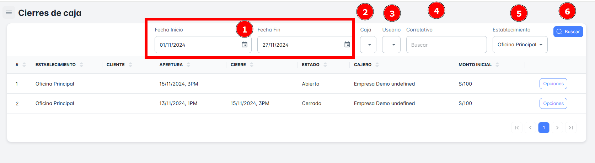
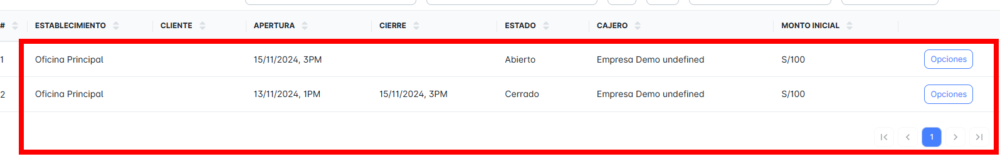
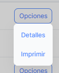

# Cierres de Caja

En este módulo podrás realizar los cierres de caja, así como visualizar el detalle de todos los registros de cierres por día o por rango de fechas. También tendrás la opción de ver los detalles o imprimir los cierres de caja.

Para **realizar la búsqueda de tus cierres de caja**, sigue estos pasos:

1. **Selecciona un rango de fechas** específico (fecha de inicio y fecha de fin).
2. **Elige la caja**, el **usuario**, el **correlativo** y el **establecimiento**.
3. Haz clic en **Buscar**.

Después de realizar estos pasos, se mostrará un listado con todos los registros disponibles según los criterios seleccionados.

## Historial de Cierres de Caja

En esta sección podrás visualizar todo el registro de cierres de caja disponibles, según el rango de fechas seleccionado en la parte superior.

## Opciones Adicionales
En este módulo, tendrás las siguientes opciones:

1. **Buscar los detalles** de cada cierre de caja específico dentro de tu listado de **"Cierre de caja"**.
2. **Imprimir** el cierre de caja correspondiente.

