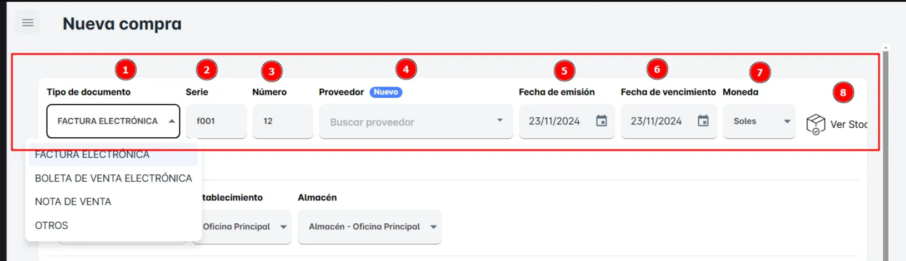
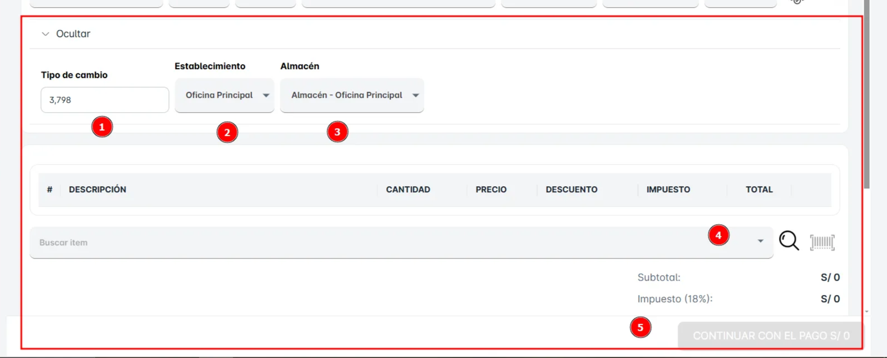

# Compras

En este modulo, se crea una nueva Compra de manera directa. Primero, haz clic en '**Compra**’

**Primero**: Al hacer clic en el botón "**Compra**", se abrirá una ventana para ingresar los datos del nuevo producto.

**Instrucciones para llenar el primer bloque numerado:**

1. **Tipo de documento**: Selecciona el tipo de documento (factura, boleta, etc.).
2. **Serie**: Ingresa el número de serie del documento.
3. **Número**: Ingresa el número del documento.
4. **Proveedor**: Selecciona o busca el proveedor.
5. **Fecha de emisión**: Ingresa la fecha de emisión del documento.
6. **Fecha de vencimiento**: Ingresa la fecha límite de pago.
7. **Moneda**: Selecciona la moneda de la compra.
8. **Ver Stock**: Haz clic para ver la disponibilidad del stock del proveedor.

Con estos pasos podrás registrar correctamente la compra y verificar los detalles necesarios.

**Segundo:**  

**1. Tipo de cambio:** Aquí se ingresa el tipo de cambio que se utilizará para el tipo de documento de venta (Factura, boleta, etc.).

**2. Establecimiento:** Se debe seleccionar el establecimiento al que pertenece la compra.

**3. Almacén:** Se debe seleccionar el almacén desde donde se enviarán los productos.

**4. Total:** Este campo muestra el total de la compra, se actualiza automáticamente al agregar productos.

**5. Continuar con el pago:** Al hacer clic en este botón, se procede al pago de la compra.

