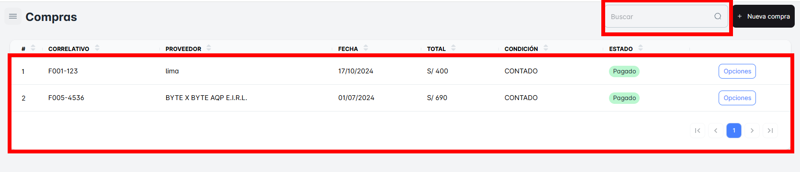
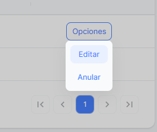
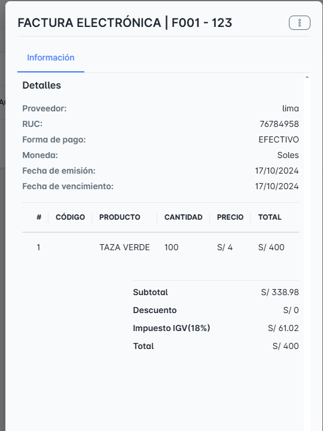
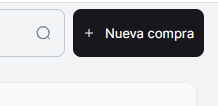

# Listado de Compras

En este módulo de **Listado de Compras**, podrás realizar la búsqueda de todas las compras generadas por tu empresa hasta la fecha.

Podrás filtrar las compras según diferentes criterios, como:

- **Correlativo de la factura**: Para buscar las compras usando el número de la factura o correlativo asignado a cada transacción.

En esta sección, podrás acceder desde el botón **"Opciones"** a las siguientes acciones:

- **Editar**: Te permitirá modificar los detalles de una compra.
- **Anular**: Te permitirá cancelar o anular una compra registrada, si es necesario.

Podrás ver todo el detalle de la compra si das clic sobre el registro de interés. Al hacer esto, se abrirá una vista detallada

En el botón "Nueva Compra", podrás crear una nueva compra. Al hacer clic en este botón, se abrirá una ventana emergente donde podrás ingresar todos los detalles necesarios para registrar la compra

[Realizar Nueva Compra](./a_nuevacompra.md)

