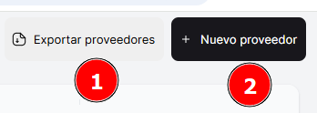

# Proveedores

En este módulo, podrás acceder a la **lista de proveedores** disponibles que tiene tu empresa hasta el momento.

Podrás realizar la **búsqueda de proveedores** desde la barra de búsqueda ubicada en la parte superior derecha de la ventana. La búsqueda se puede realizar de las siguientes maneras:

- **Por el nombre de la empresa**: Escribiendo el nombre del proveedor o empresa.
- **Por el número de documento de identidad**: Ingresando el número de identificación fiscal o de documento de la empresa o persona.

Además, tendrás dos opciones adicionales en este módulo:

1. **Exportar Proveedores**: Te permitirá exportar (Descargar) la lista de proveedores a un archivo, en formato Excel.
2. **Crear "Nuevo Proveedor"**: Te permitirá agregar un proveedor. Al seleccionar esta opción, podrás ingresar todos los datos relevantes.

### Para **crear un nuevo proveedor**

1. Haz clic en el botón **"Nuevo Proveedor"**.
2. Ingresa los datos más importantes, como:
    - **Tipo de identidad**: Selecciona el tipo de documento (RUC, DNI, etc.).
    - **Número de identidad**: Ingresa el número de identificación.
    - **Nombre**: Ingresa el nombre del proveedor.
3. Una vez ingresados los datos, **guarda los cambios** para registrar al nuevo proveedor en el sistema.

