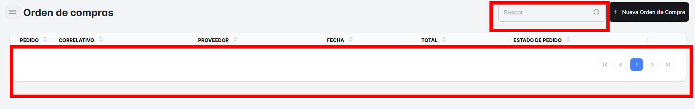
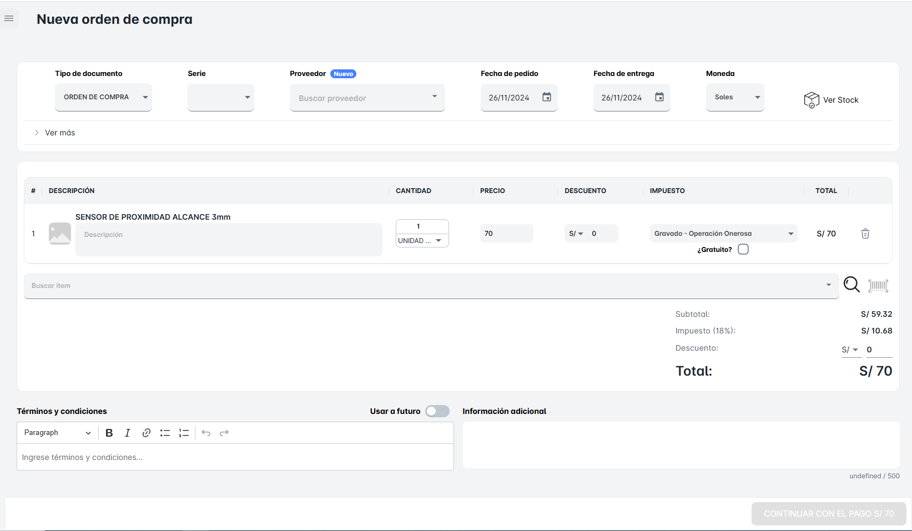
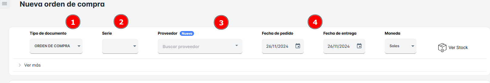
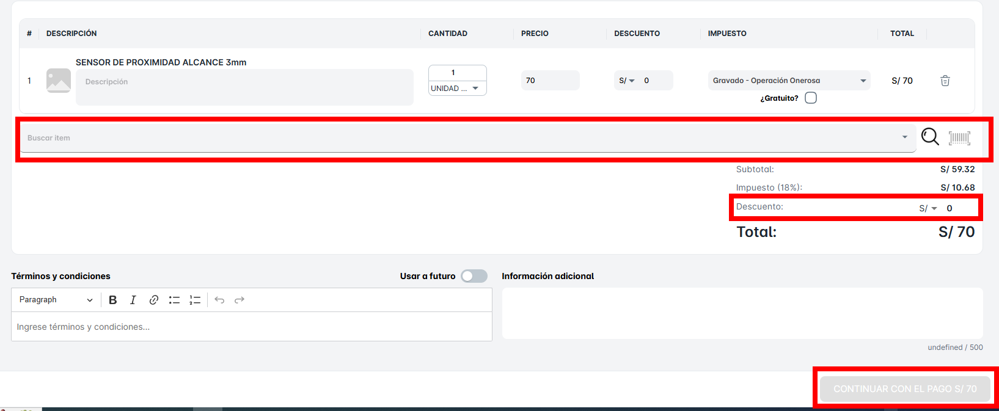

# Orden de Compra

En este módulo de **"Orden de Compras"**, podrás visualizar toda la lista de órdenes de compra que tenga tu empresa hasta el momento.

Además, tendrás la opción de realizar la **búsqueda de una orden de compra** desde la barra de búsqueda ubicada en la parte superior derecha de la ventana. Podrás buscar por:

- **Número correlativo del documento**: Ingresando el número único de la orden de compra para encontrarla rápidamente.

Podrás realizar una "Nueva Orden de Compra" dando clic sobre el botón correspondiente. Al hacer clic, se abrirá una nueva ventana emergente donde podrás ingresar los detalles necesarios para crear la orden de compra.

En la sección de la ventana **"Crear Nueva Orden de Compra"**, primero deberás completar los siguientes campos esenciales:

1. **Serie**: Selecciona la serie correspondiente para la orden de compra.
2. **Proveedor**: Elige el proveedor al que le estás realizando la compra.
3. **Fecha de Pedido**: Ingresa la fecha en la que se está realizando el pedido.
4. **Fecha de Entrega**: Define la fecha en la que esperas que se realice la entrega de los productos o servicios.

Además de los campos anteriores, no debes olvidar lo siguiente al crear una **"Nueva Orden de Compra"**:

1. **Seleccionar el Producto**: Elige los productos o servicios que deseas ordenar desde la lista disponible.
2. **Descuento (si aplica)**: Si deseas aplicar algún tipo de descuento a la orden, selecciona el porcentaje o monto a descontar.
3. **Continuar con el Pago**: Finalmente, después de revisar todos los detalles, haz clic en **"Continuar con el Pago"** para finalizar la orden de compra y proceder con la transacción.

