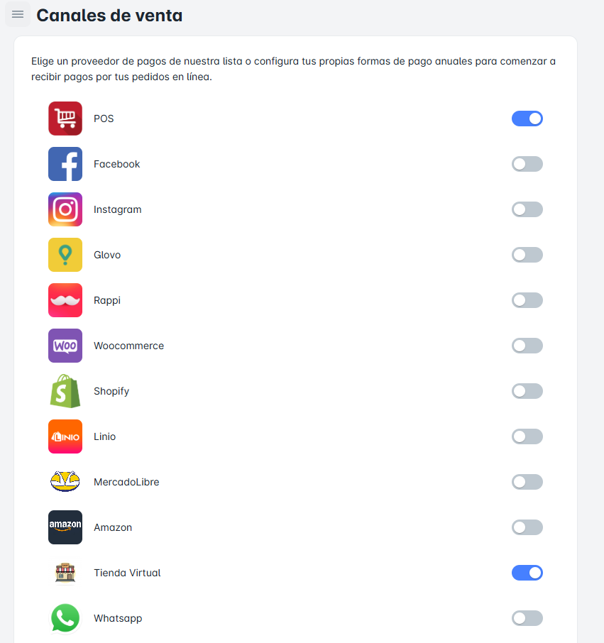

# Canales de Venta

## ¿Qué podre realizar aquí?

En este módulo, podrás **activar o desactivar los canales de venta** disponibles en la sección **"Canales de Ventas"**, lo que te permitirá **recibir pagos en línea** de manera eficiente.

## Configura tus Canales de Venta

Para configurar tus proveedores de pago desde esta página, solo debes seguir estos pasos:

1. **Activar un Canal de Venta**: Selecciona el canal de pago que deseas habilitar y actívalo para comenzar a recibir pagos en línea.
2. **Desactivar un Canal de Venta**: Si deseas dejar de usar algún proveedor de pago, puedes desactivarlo fácilmente desde esta misma página.

