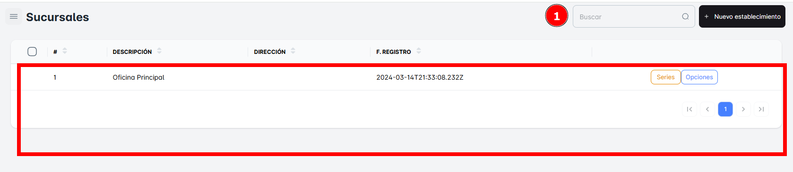
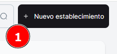
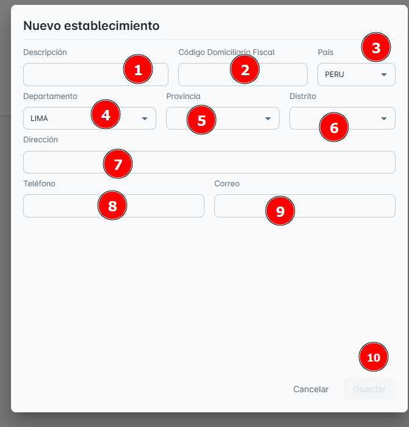

# Sucursales

En este módulo, podrás consultar el listado completo de las **sucursales** que tu empresa tiene registradas hasta el momento. Además, tendrás la opción de **crear un nuevo registro** para añadir una nueva sucursal a tu empresa.

## Buscar Sucursales

Para facilitar la búsqueda, puedes realizar una **búsqueda específica** de una sucursal utilizando la barra de búsqueda ubicada en la **parte superior derecha** de la página. Solo necesitas ingresar el **nombre de la sucursal** para encontrarla rápidamente.

## Crear ‘Nuevo Establecimiento’

Para **crear un nuevo establecimiento**, puedes hacerlo haciendo clic en el botón denominado de la misma manera. Al hacerlo, se abrirá una ventana emergente en la cual deberás ingresar los **datos correctamente**.

**Pasos**:

1. Llena los campos requeridos: **descripción**, **código domiciliario fiscal**, **país**, **departamento**, **provincia**, **distrito**, **dirección**, **teléfono** y **correo**.
2. No olvides hacer clic en **Guardar** para que los cambios se apliquen correctamente.

