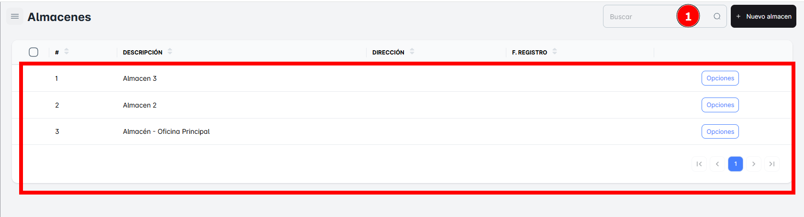
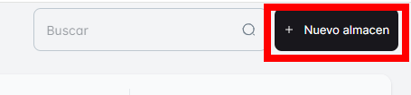
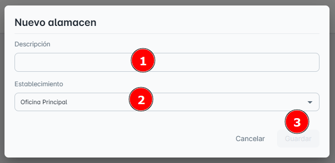
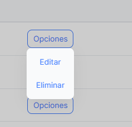

# Almacenes

En este módulo de **Almacenes**, podrás consultar todos los almacenes disponibles en tu empresa hasta el momento, así como **crear el registro de un nuevo almacén**.

## Buscar Almacenes

Para facilitar la búsqueda, puedes realizar una **búsqueda específica** de un almacén utilizando la barra de búsqueda ubicada en la **parte superior derecha** de la página. Solo necesitas ingresar el **nombre del almacén** para encontrarlo rápidamente.

## Crear ‘Nuevo Almacén’

Para **crear un nuevo almacén**, simplemente haz clic en el botón **"Nuevo Almacén"**. Al hacerlo, se abrirá una ventana emergente donde deberás ingresar los **datos correctamente** para completar el registro.

**Pasos**:

1. Llena los campos requeridos: **descripción**, y seleccionar **establecimiento**.
2. No olvides hacer clic en **Guardar** para que los cambios se apliquen correctamente.

## Opciones Adicionales

En el **Botón de Opciones**, encontrarás las siguientes acciones disponibles:

- **Editar**: Permite modificar la descripción o los datos del establecimiento seleccionado.
- **Eliminar**: Permite borrar el registro del almacén seleccionado.

