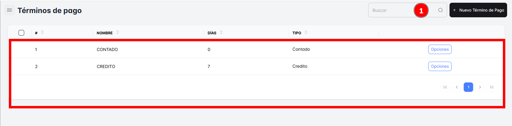
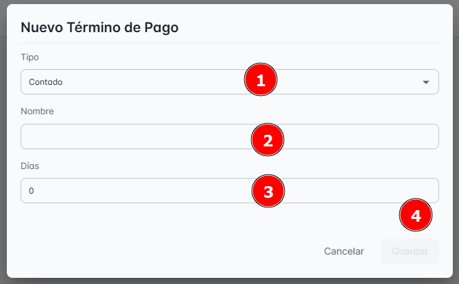
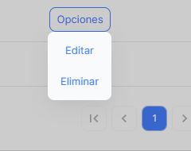

# Terminos de Pago

En este módulo de **Términos de Pago**, podrás consultar todos los términos de pago disponibles en tu empresa hasta el momento, así como **crear el registro de un nuevo término de pago**.

## Buscar Términos de Pago

Para facilitar la búsqueda, puedes realizar una **búsqueda específica** de un término de pago utilizando la barra de búsqueda ubicada en la **parte superior derecha** de la página. Solo necesitas ingresar el **nombre del término de pago** para encontrarlo rápidamente.

## Crear ‘Nuevo Termino de Pago’

Para **crear un nuevo termino de pago**, simplemente haz clic en el botón **"Nuevo Termino de Pago"**. Al hacerlo, se abrirá una ventana emergente donde deberás ingresar los **datos correctamente** para completar el registro.

**Pasos**:

1. Llena los campos requeridos: **nombre y días.**
2. Seleccionar tipo de termino de pago.
3. No olvides hacer clic en **Guardar** para que los cambios se apliquen correctamente.

## Opciones Adicionales

En el **Botón de Opciones**, encontrarás las siguientes acciones disponibles:

- **Editar**: Permite modificar la descripción o los datos del registro de **término de pago** seleccionado.
- **Eliminar**: Permite borrar el **registro del almacén** seleccionado.

