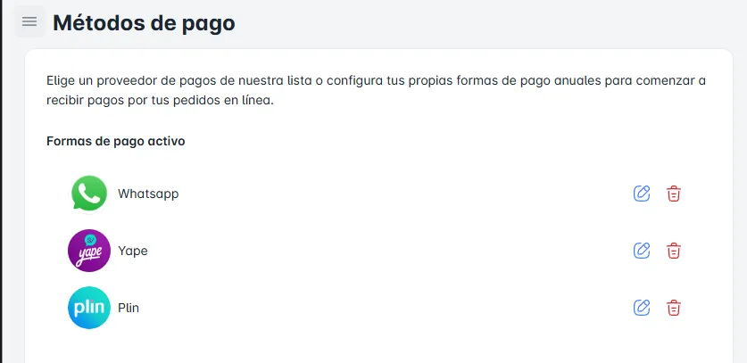
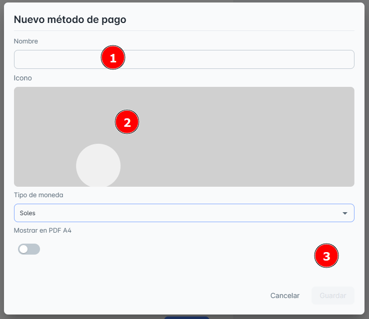
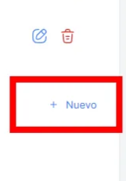
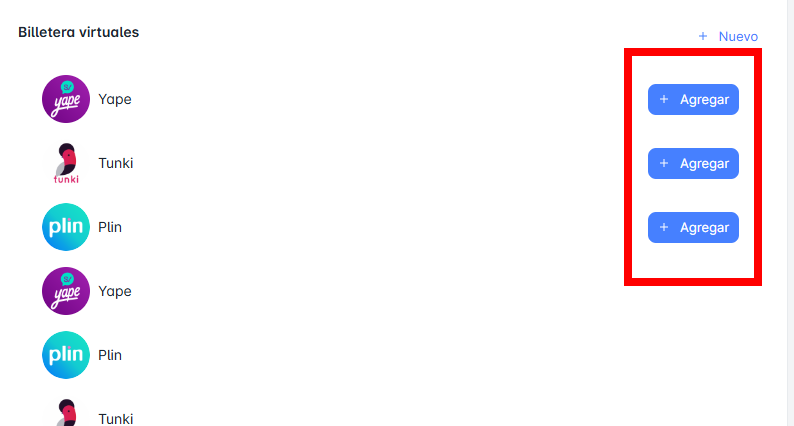

# Metodos de Pago

En este módulo de **Términos de Pago**, podrás consultar todos los términos de pago disponibles en tu empresa hasta el momento, así como **crear el registro de un nuevo término de pago**.

## Editar o Eliminar

En esta sección, puedes **editar** o **eliminar** un término de pago utilizando los iconos ubicados al costado de cada forma de pago. Solo necesitas hacer clic en el **icono azul** para editar o en el **icono rojo** para eliminar.

## Crear ‘Nuevo Método de Pago’

Para **crear un nuevo método de pago**, simplemente haz clic en el botón **"Nuevo"**. Al hacerlo, se abrirá una ventana emergente donde deberás ingresar los **datos correctamente** para completar el registro.

**Pasos**:

1. Llena los campos requeridos: **nombre**, y seleccionar **icono y tipo de moneda**.
2. No olvides hacer clic en **Guardar** para que los cambios se apliquen correctamente.

## Agregar ‘Método de Pago’

Para agregar una billetera virtual creada a las formas de pago activadas, sigue estos pasos:

1. Dirígete a la sección de **"Billeteras Virtuales"**.
2. Al costado de cada billetera, encontrarás un botón denominado **"Agregar"**.
3. Haz clic en este botón para activar la billetera virtual en tus **formas de pago disponibles**.

