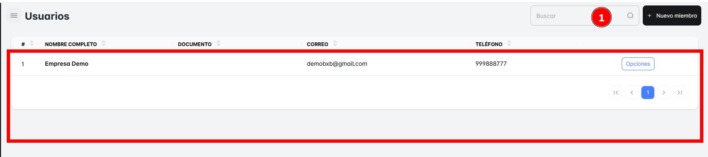
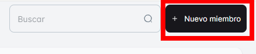
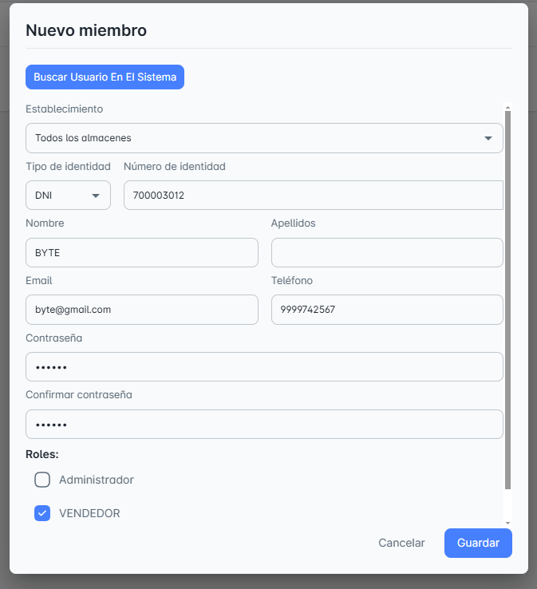
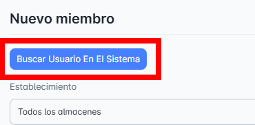
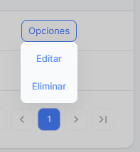

# Usuarios

En este módulo de Usuarios, podrás consultar todos los usuarios disponibles en tu empresa hasta el momento, así como **crear el registro de un nuevo usuario**.

## Buscar Nuevo Usuario

Para facilitar la búsqueda, puedes realizar una **búsqueda específica** de un almacén utilizando la barra de búsqueda ubicada en la **parte superior derecha** de la página. Solo necesitas ingresar el **nombre del usuario** para encontrarlo rápidamente.

## Crear Nuevo Usuario

Para **crear un nuevo usuario**, simplemente haz clic en el botón **"Nuevo miembro"**. Al hacerlo, se abrirá una ventana emergente donde deberás ingresar los **datos correctamente** para completar el registro.

**Pasos**:

- Selecciona el **establecimiento** y el **tipo de documento**.
- Llena los campos requeridos: **número de identidad**, **nombre**, **apellidos**, **correo**, **teléfono** y **contraseña**.
- Selecciona el **tipo de rol** para el nuevo miembro.
- No olvides hacer clic en **Guardar** para que los cambios se apliquen correctamente.

## Opciones Adicionales

En el **Botón de Opciones**, encontrarás las siguientes acciones disponibles:

- **Editar**: Permite modificar la descripción o los datos del usuario seleccionado.
- **Eliminar**: Permite borrar el registro del usuario seleccionado.

