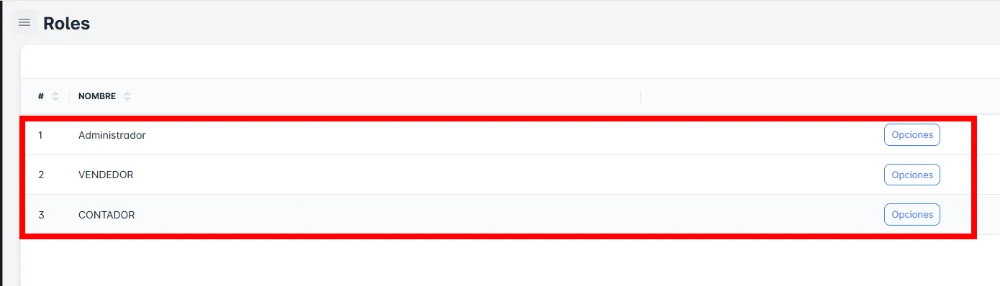
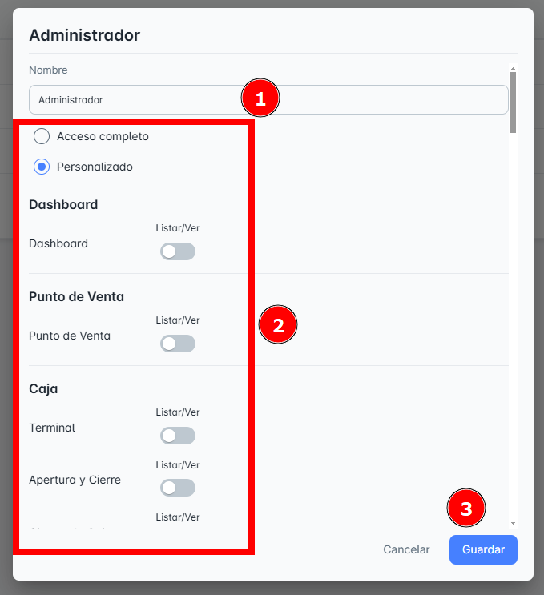
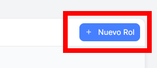
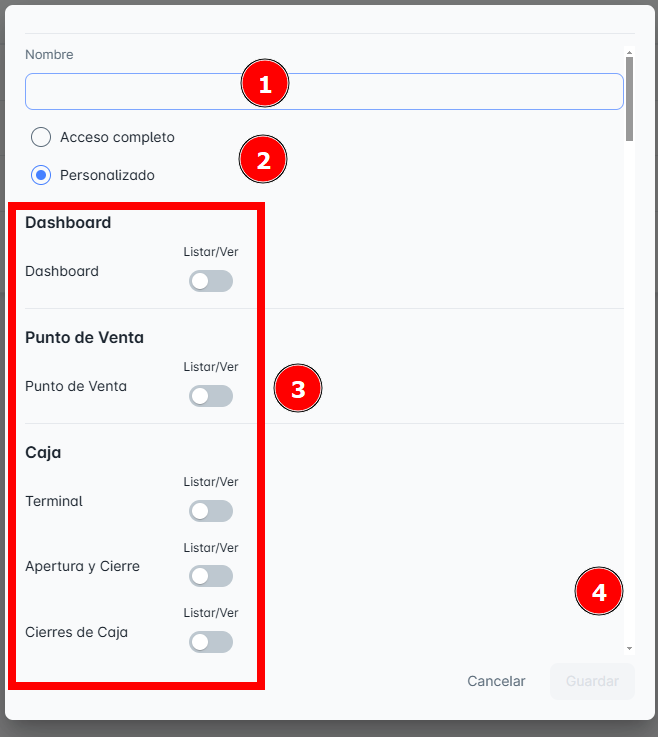
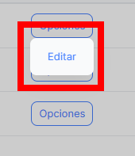

# Roles y Permisos

En este módulo de **Roles y Permisos**, podrás consultar todos los roles y permisos disponibles en tu empresa hasta el momento, así como **crear** 

**el registro de un nuevo rol**.

## Visualizar los Roles

Al ingresar a la página de **Roles y Permisos**, podrás visualizar una lista completa de los roles registrados hasta el momento.

## Detalle de Permisos por Rol

En esta sección podrás ver un detalle completo de todos los permisos y configuraciones asignados a cada rol creado en tu empresa.

### 1. Configuración del **Dashboard**, **Punto de Venta** y **Caja**

- Podrás gestionar y ajustar los permisos relacionados con el acceso y configuración del **Dashboard**, **Punto de Venta** y **Caja** para cada rol.

## Crear Nuevo Rol

Para **crear un nuevo rol**, sigue estos pasos:

1. Haz clic en el botón **"Nuevo rol"**. Esto abrirá una ventana emergente donde podrás ingresar los **datos correctamente** para completar el registro y configurar los permisos si es necesario.

**Pasos**:

- Llena el campo requerido: **Nombre del Rol**.
- Selecciona el **tipo de permiso**.
- Si seleccionas un tipo de permiso personalizado, configura los permisos correspondientes.
- No olvides hacer clic en **Guardar** para que los cambios se apliquen correctamente.

## Editar Roles y Permisos de Usuarios

En el **Botón de Opciones**, encontrarás la siguiente acción disponible:

- **Editar**: Permite modificar la descripción o los datos del **rol** seleccionado.

