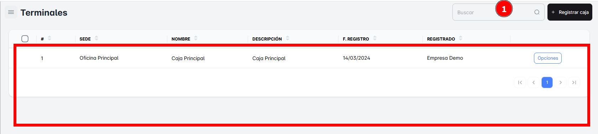
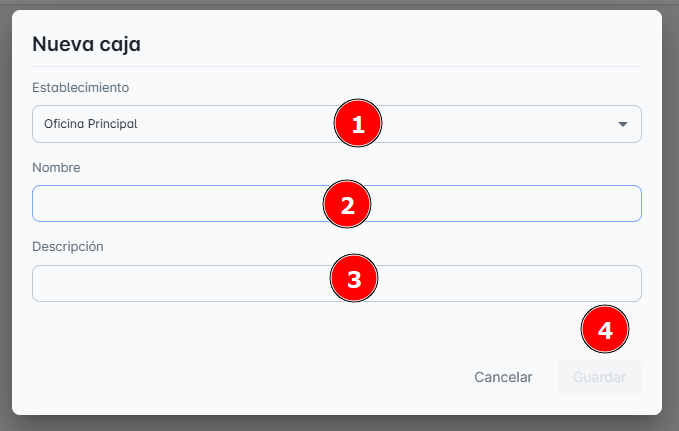
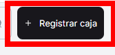
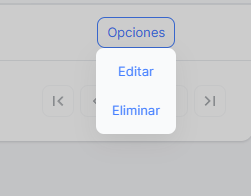

# Terminales

En este módulo de **Terminales**, podrás consultar todas las cajas disponibles en tu empresa hasta el momento, así como **crear el registro de una nueva caja**.

## Buscar las Terminales o “Cajas”

Para facilitar la búsqueda, puedes realizar una **búsqueda específica** de una caja utilizando la barra de búsqueda ubicada en la **parte superior derecha** de la página. Solo necesitas ingresar el **nombre de la caja** en la barra de búsqueda para encontrarla rápidamente.

## Registrar una Nueva Caja

Para **crear un nueva caja**, simplemente haz clic en el botón **"Registrar Caja"**. Al hacerlo, se abrirá una ventana emergente donde deberás ingresar los **datos correctamente** para completar el registro.

**Pasos**:

1. Selecciona Establecimiento
2. Llena los campos requeridos: nombre y **descripción.**
3. No olvides hacer clic en **Guardar** para que los cambios se apliquen correctamente.

## Opciones Adicionales

En el **Botón de Opciones**, encontrarás las siguientes acciones disponibles:

- **Editar**: Permite modificar la descripción o los datos de la caja seleccionada.
- **Eliminar**: Permite borrar el registro de la caja o terminal seleccionada.

