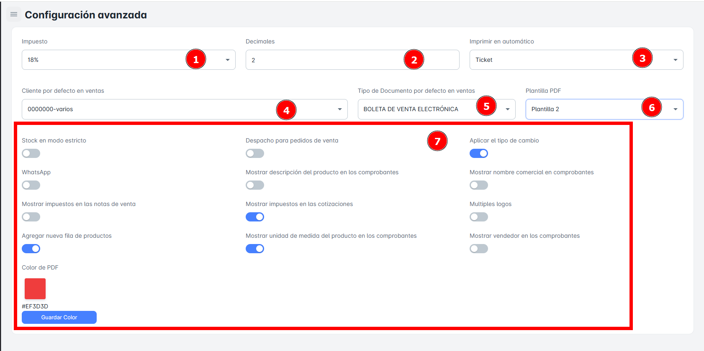

# Configuracion Avanzada

En este módulo de **Configuración Avanzada**, podrás configurar todo lo necesario para realizar tus ventas de la manera más óptima y eficiente. Tendrás la capacidad de ajustar los parámetros necesarios para:

- Mantener tu **stock** bajo control de manera más estricta.
- Mostrar detalles específicos en los **comprobantes de venta**.
- Configurar opciones relacionadas con **cotizaciones** y **despachos** para pedidos de venta.

## ¿Qué podre Configurar?

Podrás configurar los siguientes aspectos:

- **Seleccionar impuesto**.
- Definir los **decimales en ventas y costos de productos**.
- Elegir el **tipo de impresión automática**.
- Establecer el **nombre del cliente por defecto**.
- Configurar el **tipo de comprobante de venta por defecto**.
- Seleccionar el **tipo de plantilla PDF**.

### **Activar o Desactivar**

- **Stock en modo estricto**.
- **Mostrar impuestos en notas de venta**.
- **Despacho de pedidos**.
- **Mostrar la descripción del producto en los comprobantes**.
- **Mostrar impuestos en cotizaciones**.
- **Mostrar unidad de medida en los comprobantes**.
- **Aplicar tipo de cambio**.
- **Mostrar el nombre comercial en los comprobantes**.
- **Mostrar vendedor en los comprobantes**.

