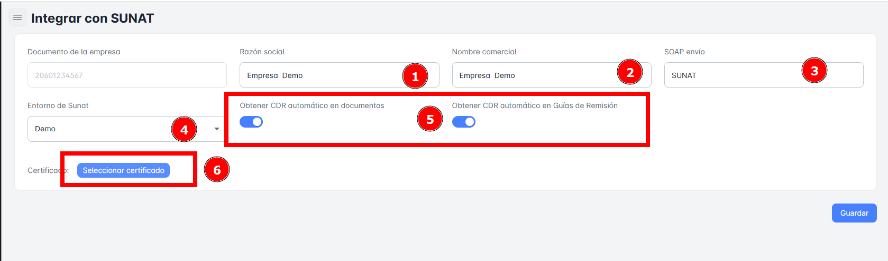

# Integrar con SUNAT

En este módulo informativo, se especifica que la **única persona autorizada** para realizar los cambios necesarios para la **integración con la SUNAT** será el **administrador del sistema**. Esto garantiza que los procesos de integración se lleven a cabo de manera segura y conforme a las normativas establecidas.

## ¿Cómo Integrar con la SUNAT?

Para integrar tu sistema con la SUNAT, sigue los siguientes pasos, los cuales deben ser realizados exclusivamente por el **administrador del sistema**:

1. **Obtener el RUC y Certificado Digital**:
    - Asegúrate de que tu empresa tenga un **RUC** activo registrado ante la SUNAT.
    - Obtén un **certificado digital** que será utilizado para firmar los comprobantes electrónicos.
2. **Configurar el Sistema de Ventas**:
    - El sistema de ventas debe estar configurado para emitir comprobantes electrónicos (facturas, boletas, etc.) en el formato requerido por la SUNAT.
    - Asegúrate de que el sistema pueda generar archivos en formato **XML** y PDF.
3. **Conectar con el Sistema de Emisión Electrónica de la SUNAT (SEE)**:
    - Realiza la integración técnica del sistema de ventas con el **Sistema de Emisión Electrónica (SEE)** de la SUNAT, de modo que los comprobantes generados sean enviados automáticamente para su validación.
4. **Pruebas y Validación**:
    - Realiza pruebas de emisión de comprobantes para verificar que el sistema de ventas esté correctamente integrado con la SUNAT.
    - Asegúrate de que los comprobantes sean aceptados o rechazados de acuerdo con las normativas fiscales.
5. **Monitoreo y Actualizaciones**:
    - El administrador debe asegurarse de que el sistema esté constantemente actualizado según las nuevas regulaciones de la SUNAT.
    - Realiza un monitoreo regular del sistema para garantizar el correcto funcionamiento de la integración.

    