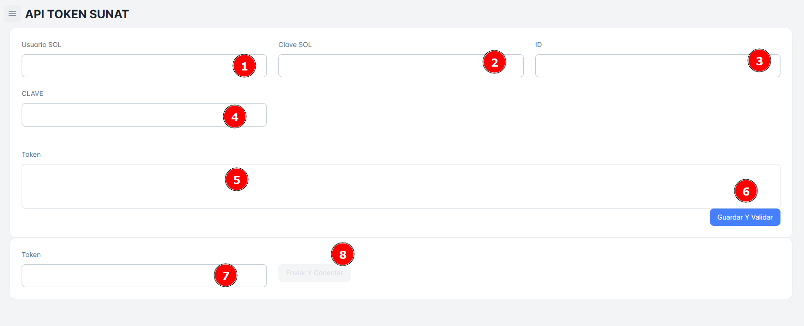

# Api Token SUNAT

En este módulo informativo, se especifica que la **única persona autorizada** para realizar los cambios necesarios para generar el **API Token con la SUNAT** será el **administrador del sistema**. Esto asegura que la integración se realice de manera segura y conforme a las normativas de la SUNAT.

## Generar mi API Token

Para generar el **API Token con la SUNAT**, sigue estos pasos. Ten en cuenta que este proceso debe ser realizado por el **administrador del sistema** para garantizar la correcta configuración y seguridad de la integración:

### Pasos para generar

1. **Accede al Portal de SUNAT**:
    - Ingresa al sitio web oficial de la **SUNAT**
    - En la página principal, busca la opción relacionada con **Comprobantes Electrónicos** o **Emisión Electrónica**.
2. **Inicia sesión con tu RUC y Clave SOL**:
    - Para acceder al sistema de emisión electrónica, debes iniciar sesión con el **RUC** de tu empresa y la **Clave SOL**. La **Clave SOL** es una clave de acceso personal que te permite interactuar con los servicios digitales de la SUNAT.
3. **Accede a la opción de 'API Token'**:
    - Una vez dentro del portal, busca la sección de **"Servicios de API"** o **"Integración SUNAT"**.
    - En esta sección, selecciona la opción para **generar un API Token**.
4. **Solicita el API Token**:
    - El sistema te pedirá que ingreses ciertos datos de tu empresa, como el **RUC** y el **nombre del establecimiento**.
    - Después de ingresar los datos, el sistema generará un **API Token** único, que se utilizará para realizar las conexiones seguras entre tu sistema y los servicios de SUNAT.
5. **Guarda el API Token**:
    - El **API Token** generado debe ser **guardado de manera segura**. Este token será utilizado para autenticar las solicitudes que tu sistema realice a la SUNAT a la hora de emitir comprobantes electrónicos.
    - Asegúrate de que solo las personas autorizadas tengan acceso a este token, ya que es fundamental para el proceso de validación de los comprobantes.
6. **Configura el API Token en tu Sistema de Ventas**:
    - Una vez que tengas el **API Token**, debes configurarlo en tu **sistema de ventas para la** integración de tu empresa.
    - Este proceso se realiza en la sección de **integración con SUNAT** del sistema.
    - Introduce el **API Token** en los campos correspondientes del sistema, asegurándote de que se establezca correctamente la conexión con la SUNAT.
7. **Pruebas de Integración**:
    - Realiza pruebas de emisión de comprobantes electrónicos para asegurarte de que el **API Token** funciona correctamente y que el sistema puede comunicarse con la SUNAT sin problemas.
    - Verifica que los comprobantes generados sean aceptados por la SUNAT y que no haya errores en el proceso de validación.

