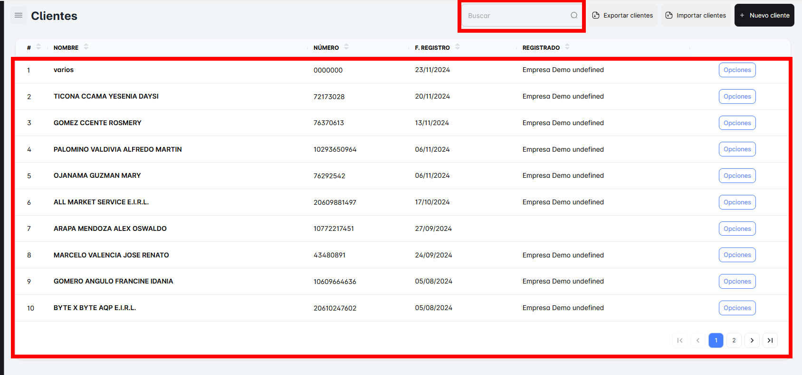
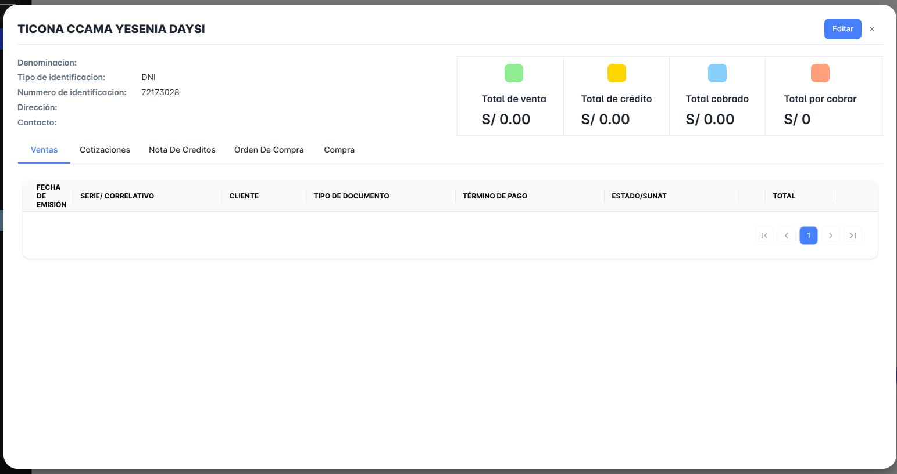
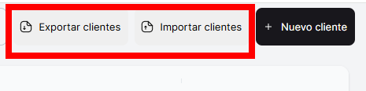
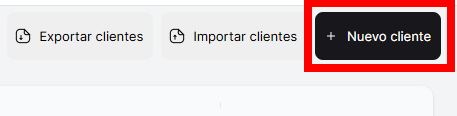
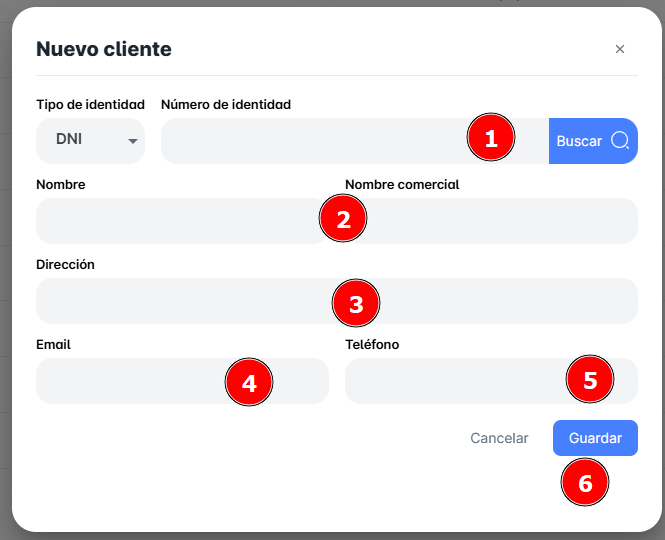

# Clientes

En este módulo podrás consultar el listado completo de clientes registrados en tu empresa hasta el momento. Además, tendrás la posibilidad de realizar búsquedas específicas para encontrar a cada cliente de forma más eficiente. Entre las funcionalidades disponibles, podrás:

- **Consultar el listado de clientes**: Accede a toda la base de datos de clientes de tu empresa.
- **Buscar de manera avanzada**: Filtra los clientes según diferentes criterios, como nombre, para obtener resultados más precisos.
- **Exportar a Excel**: Descarga toda la información de tus clientes en un archivo Excel para análisis o para compartir con tu equipo.
- **Crear nuevos registros de clientes**: Agrega nuevos clientes a tu base de datos de forma rápida y sencilla.

## ¿Cómo buscar tus Clientes?

Podrás realizar la búsqueda de un cliente específico accediendo a la barra de búsqueda ubicada en la parte superior derecha. En este campo, simplemente ingresa el nombre del cliente y, de forma automática, se mostrará el registro correspondiente.

Si haces clic sobre el registro de un cliente en particular, se abrirá una ventana emergente donde podrás ver todos los detalles del cliente, incluyendo el total de ventas, el total de crédito, lo cobrado y lo pendiente por cobrar.

## ¿Cómo importar tus clientes?

Podrás importar (subir) archivos Excel con los datos de tus clientes, siempre que estén en el mismo formato que la plantilla que descargarás al exportar tu base de datos. El botón para realizar la importación se encuentra en la parte superior derecha de la página de Clientes.

## ¿Cómo exportar tus clientes?

También podrás exportar toda la base de datos de tus clientes con un solo clic en el botón ubicado en la parte superior derecha de la página, junto al botón de importación de clientes. El archivo exportado estará en formato Excel.

## Crear un ‘Nuevo cliente’

Para crear un nuevo cliente, simplemente haz clic en el botón correspondiente ubicado en la parte superior derecha. Se abrirá una nueva ventana emergente donde podrás ingresar todos los datos necesarios. No olvides guardar los cambios una vez que hayas completado la información.

## Pasos para Crear un Nuevo Clientes

- Selecciona el tipo de documento de identidad.
- Ingresa el número del documento.
- Haz clic en **BUSCAR** para que se cargue automáticamente el nombre del cliente.
- Ingresa la dirección, el correo electrónico y el teléfono del cliente.

