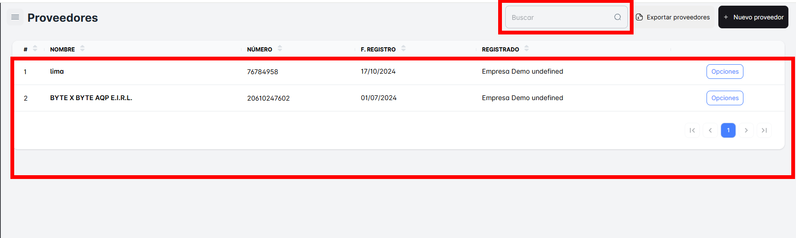
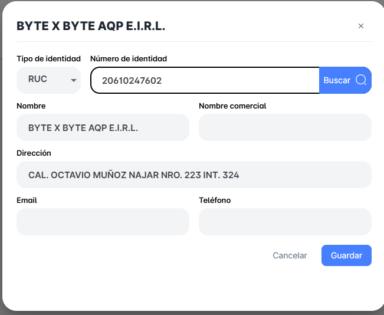
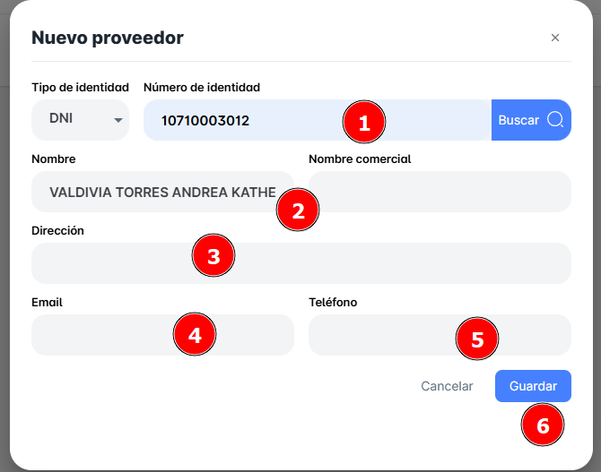

# Proveedores

En este módulo, podrás consultar el listado completo de proveedores registrados en tu empresa hasta el momento. Además, tendrás la opción de realizar búsquedas específicas para encontrar a cada proveedor de manera más eficiente. Entre las funcionalidades disponibles, podrás:

- **Consultar el listado de proveedores**: Accede a toda la base de datos de proveedores de tu empresa.
- **Búsqueda avanzada**: Filtra los proveedores según diferentes criterios, como nombre, para obtener resultados más precisos.
- **Exportar a Excel**: Descarga toda la información de tus proveedores en un archivo Excel para análisis o para compartir con tu equipo.
- **Crear nuevos registros de proveedores**: Agrega nuevos proveedores a tu base de datos de forma rápida y sencilla.

## Busca tus Proveedores

Podrás realizar la búsqueda de un proveedor específico accediendo a la barra de búsqueda ubicada en la parte superior derecha. En este campo, simplemente ingresa el nombre del proveedor y, de forma automática, se mostrará el registro correspondiente.

Si haces clic en el registro de un proveedor en particular, se abrirá una ventana emergente donde podrás ver todos los detalles del proveedor. Además, tendrás la opción de realizar cambios y editar la información según sea necesario.

## Exportar tus Proveedores

También podrás exportar toda la base de datos de tus proveedores con un solo clic en el botón ubicado en la parte superior derecha de la página, junto al botón de nuevo proveedor. El archivo exportado estará en formato Excel.

## Crear un ‘Nuevo proveedor’

Para crear un nuevo proveedor, simplemente haz clic en el botón correspondiente ubicado en la parte superior derecha. Se abrirá una nueva ventana emergente donde podrás ingresar todos los datos necesarios. No olvides guardar los cambios una vez que hayas completado la información.

- Selecciona el tipo de documento de identidad.
- Ingresa el número del documento.
- Haz clic en **BUSCAR** para que se cargue automáticamente el nombre del proveedor.
- Ingresa la dirección, el correo electrónico y el teléfono del proveedor

