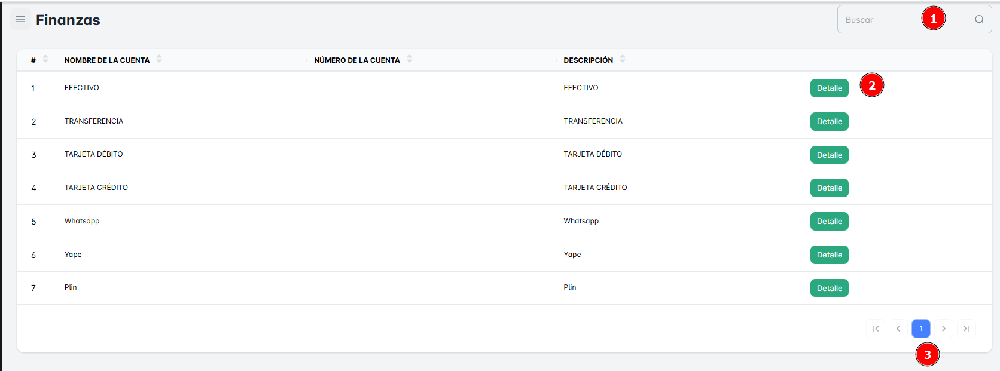
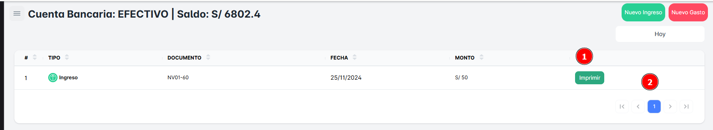
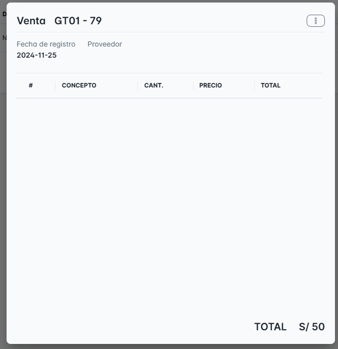

# Cuentas

En este módulo encontrarás las distintas modalidades de pago disponibles en la empresa. Para localizar cualquier cuenta que tengas registrada, utiliza el buscador que se encuentra en la parte superior derecha, en el campo 'Buscar’ con el Nombre de la Cuenta.

## **Visualizar Ventas realizadas**

Al hacer clic en cualquiera de las cuentas disponibles en la lista, podrás ver los detalles y el saldo disponible.

Para **visualizar las ventas realizadas**, sigue estos pasos:

1. **Accede a la lista de ventas**: Dentro del módulo, encontrarás una lista de las ventas realizadas.
2. **Haz clic en una cuenta específica**: Al seleccionar cualquiera de las cuentas de la lista, podrás ver más detalles sobre esa venta. Esta información incluirá el saldo disponible, los productos o servicios vendidos, y otros detalles importantes.

## Visualizar el Detalle de Venta

Para **visualizar el detalle de una venta** en el módulo de movimientos, sigue estos pasos:

1. **Haz clic sobre la venta**: Si deseas ver los detalles de una venta específica, 
2. **Ventana Emergente**: Al hacer clic en la venta, se abrirá una nueva ventana emergente con toda la información relevante de esa venta, como el monto, fecha, productos o servicios vendidos, y cualquier otro detalle que hayas registrado.

