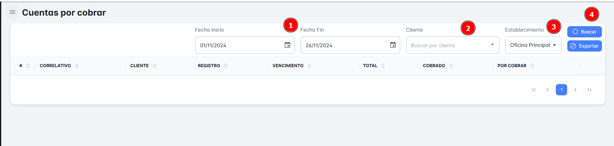

# Cuentas por Cobrar

**Primero: ¿Qué una Cuenta por Cobrar?**

Las cuentas por cobrar representan el dinero que los clientes deben a la empresa por los bienes o servicios que se les han proporcionado a crédito. Normalmente, la empresa emite una factura para informar al cliente sobre el monto adeudado. 

**¿Qué encontraras en la ventana de Cuentas por Cobrar?**

En esta sección, podrás buscar las **Cuentas por Cobra**r filtrando por un rango de **fechas** (inicio y fin), el **nombre del cliente** y la **sede**.

