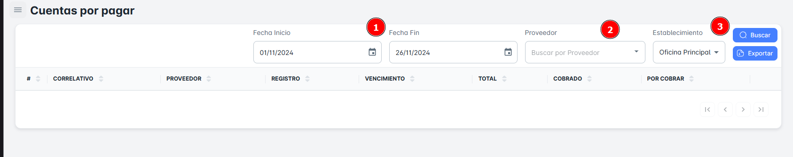

# Cuentas por Pagar

**Primero: ¿Qué son Cuentas por Pagar?**

Las **cuentas por pagar** son las deudas que tu empresa tienes con tus proveedores o acreedores por los productos o servicios que hayas adquirido. Si la empresa **recibe productos antes de efectuar** el pago, esa compra se registra en las cuentas por pagar. 

**¿Qué encontraras en la ventana de Cuentas por Pagar?**

En esta sección, podrás buscar las **Cuentas por Pagar** filtrando por un rango de **fechas** (inicio y fin), el **nombre del Proveedor** y el **Establecimiento**.

