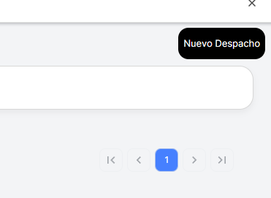

# Crear una guía de Remisión

<video controls style="max-width: 100%; border: 1px solid #ddd; border-radius: 8px; padding: 4px;">
  <source src="/video/guiaremision/video.mp4" type="video/mp4">
  Tu navegador no soporta el elemento de video.
</video>

Para **crear una nueva Guía de Remisión** y realizar un despacho en tu empresa, sigue estos pasos:

1. **Accede al módulo de Guías de Remisión**: Si aún no tienes una guía activa, puedes proceder a crear una nueva.
2. **Haz clic en el botón [Nuevo Despacho]**: Este botón te llevará a la sección donde podrás generar la nueva guía de remisión necesaria para tu despacho.
3. **Completa los datos requeridos**: Se te pedirá información sobre los productos que deseas despachar, datos de la empresa, y el destino de la remisión.

Recuerda que este proceso es esencial para formalizar el despacho de mercancías de acuerdo a las normativas.

