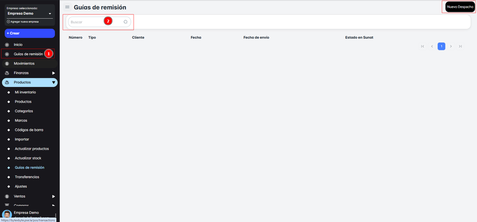

# Introduccion

En el módulo de **Guías de Remisión**, tendrás acceso directo para consultar todas las guías disponibles en tu sistema. Si necesitas realizar un despacho y aún no cuentas con una Guía de Remisión, puedes **crear una nueva** utilizando el botón

A continuación, te proporciono los pasos esenciales:

1. **Consultar Guías Disponibles**: Aquí podrás ver todas las guías de remisión activas y consultar detalles sobre ellas.
2. **Crear Nueva Guía**: Si aún no tienes una Guía de Remisión y necesitas despachar productos, puedes generar una nueva a través del **Botón ‘Nuevo Despacho’ e**ste botón te llevará a la creación de una nueva guía de remisión para facilitar el despacho de mercancías.

