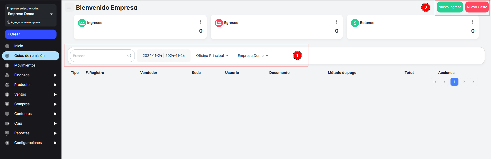
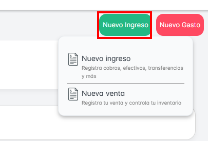
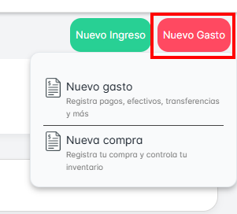

# Movimientos

En el **Módulo de Movimientos**, podrás gestionar los **ingresos**, **egresos**, **ventas**, y **compras** de tu empresa. Este módulo te permitirá llevar un registro detallado de los movimientos financieros, lo que te ayudará a obtener un balance total. Además, podrás realizar búsquedas por fecha y código de venta para facilitar la consulta.

### Funciones Principales:

1. **Consultar Movimientos**: Verifica los ingresos y egresos de la empresa de manera clara y organizada.
2. **Búsquedas por Fecha o Código de Venta**: Facilita la consulta rápida de movimientos específicos.

## Crear nuevo ingreso o venta

Al presionar el botón **Nuevo Ingreso**, tendrás dos opciones:

- **Nuevo Ingreso**: Registra el ingreso de dinero.
- **Nueva Venta**: Registra una venta realizada.

## Crear nuevo gasto o compra

Al hacer clic en el botón **Nuevo Gasto**, tendrás las siguientes opciones:

- **Nuevo Gasto**: Registra un gasto realizado.
- **Nueva Compra**: Registra la adquisición de bienes o servicios.

