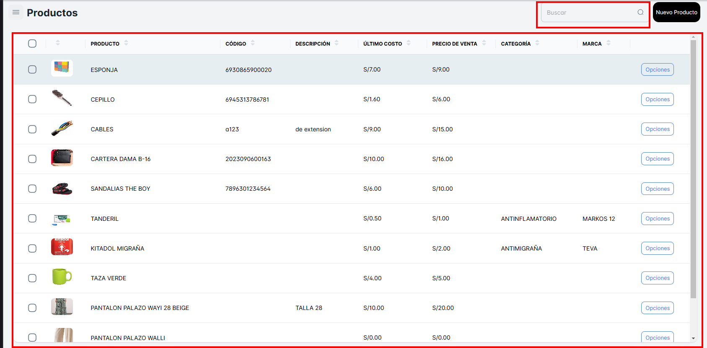
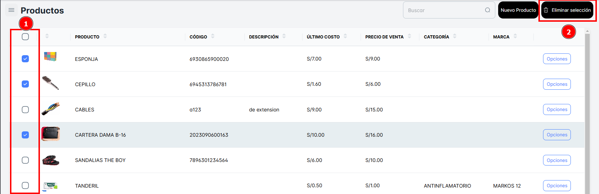
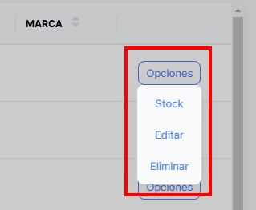
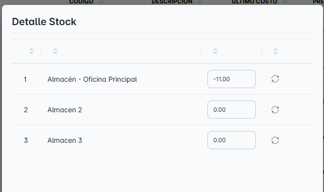
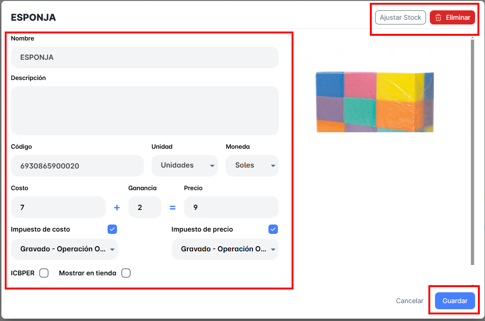

# Productos

## ¿Qué podrás ver en ‘Productos’?

En este módulo de productos, podrás ver toda la lista de productos disponibles en tu empresa, junto con su respectivo "**Costo**" y "**Precio de Venta"**. Además, podrás buscar cualquier producto ingresado utilizando su "**Nombre**" o "**Código**”

**¿Cómo eliminar de forma masiva todo lo seleccionado?**

Puedes hacerlo seleccionando los casilleros (checkbox) de todos los productos que ya no deseas tener en tu lista. Al seleccionar los productos, se activará un nuevo botón llamado "**Eliminar Selección**", el cual eliminará todos los productos que hayas marcado.

**¿Qué podrás realizar desde el Botón “Opciones”?**

En esta Sección encontraras 3 opciones:

1.  Stock
2. Editar
3. Eliminar

Primero, en la opción "Stock", se abrirá una nueva ventana emergente donde podrás ver el detalle del stock del producto seleccionado, accediendo a través del botón "Opciones".

Segundo: En la opción "**Editar**", se abrirá una nueva ventana emergente donde podrás modificar los datos del producto, como su "**Nombre**", "**Código**", "**Imagen**", "**Costo**", "**Ganancia**" y "**Tipos de Impuesto**". Después de realizar los cambios, podrás guardarlos.

También tendrás la opción de "**Ajustar Stock**" del producto o "**Eliminar**" el producto.

