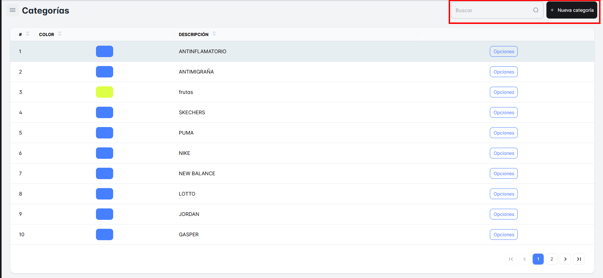
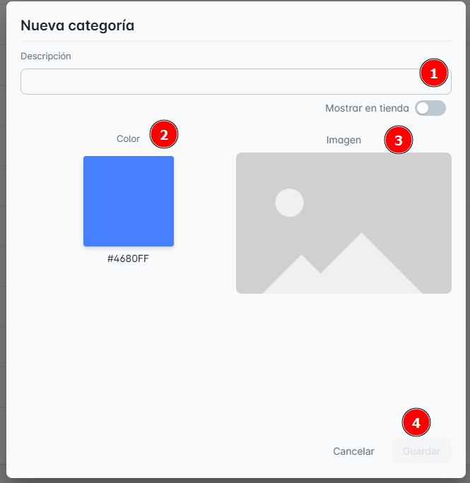
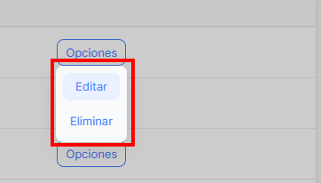
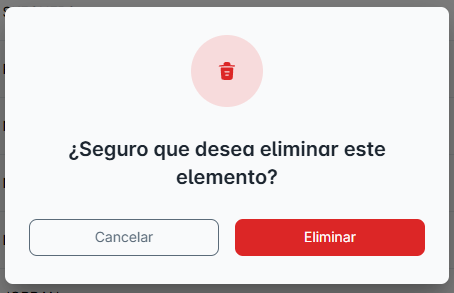

# Categorias

## ¿Qué encontraras en ‘Categorías’?

En esta sección podrás ver todas las "**Categorías**" disponibles de los productos.

También tendrás la opción de "Buscar" cualquier categoría específica que desees visualizar.

**¿Cómo crear una nueva categoría?**

Al hacer clic en el botón "Nueva Categoría", podrás ingresar la "Descripción", seleccionar un "Color" e "Imagen". Una vez que hayas ingresado toda la información, no olvides hacer clic en el botón "Guardar" para registrar la nueva categoría.

Botón “Opciones” dispone de:

1. Editar
2. Eliminar

Primero, en la opción "Editar", se abrirá una ventana emergente donde podrás ver los detalles del producto seleccionado y modificar los datos que necesites. No olvides hacer clic en "Guardar" para registrar los cambios.

Segundo, en esta opción, "Eliminar", se abrirá una nueva ventana emergente con dos opciones: "Cancelar" o "Eliminar". Si haces clic en "Eliminar", la categoría será eliminada automáticamente de tu lista principal de Categorías.