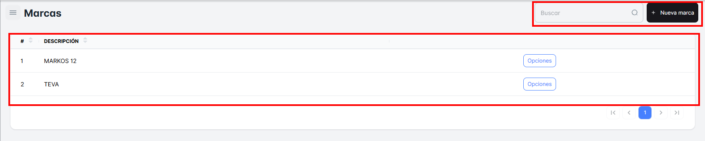
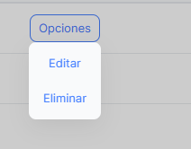
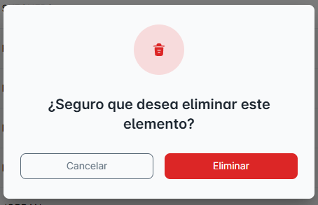

# Marcas

## ¿Qué podrás encontrar en ‘Marcas’?

En esta sección podrás ver todas las "**Marcas**" disponibles de los productos.

También tendrás la opción de "Buscar" cualquier marca específica que desees visualizar.

y Crear una “Nueva Marca”.

Botón “Opciones” dispone de:

1. Editar
2. Eliminar

Primero, en la opción "Editar", se abrirá una ventana emergente donde podrás ver los detalles de la marca seleccionada y modificar los datos que necesites. No olvides hacer clic en "Guardar" para registrar los cambios.

Segundo, en esta opción, "Eliminar", se abrirá una nueva ventana emergente con dos opciones: "Cancelar" o "Eliminar". Si haces clic en "Eliminar", la marca será eliminada automáticamente de tu lista principal de Marcas.

