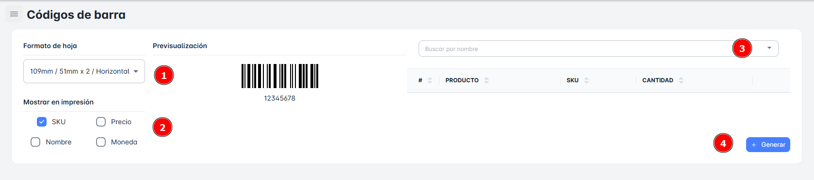
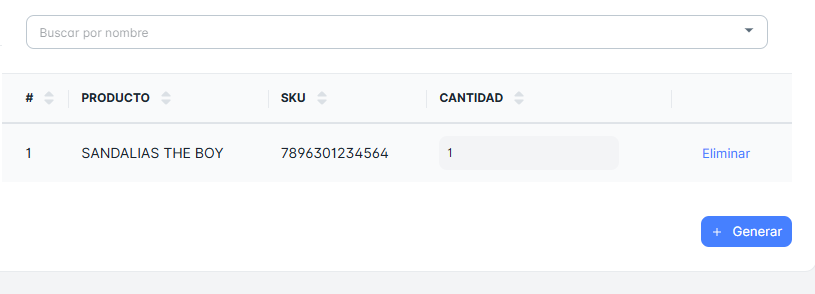

# Codigo de Barras

En esta sección, podrás generar un "Código de Barras" para todos los productos disponibles en la lista.

Podrás seleccionar el "Tamaño de la Hoja" y tendrás la opción de incluir en la impresión los siguientes datos:

- SKU
- Nombre
- Precio
- Moneda

No olvidar dar clic a “Generar” para pasar a imprimir el “Código de Barras”

También tendrás la opción de "Buscar" cualquier producto en específico que desees visualizar.

