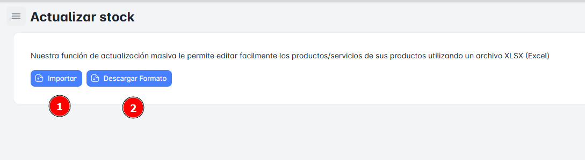

# Actualizar Stock

## ¿Cómo ‘Actualizar Stock’?

En esta sección, podrás "Actualizar Stock" (subir) el archivo Excel con todos los datos necesarios del Stock de los productos en cada Almacén.

Se puede descargar el Archivo de Excel con el Stock de productos disponibles por Almacén, este archivo ya cuenta con el formato requerido se puede descargar desde el botón "**Descargar Formato**".

