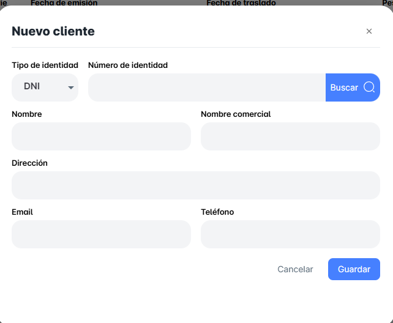
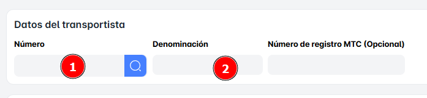

# Guias de Remision

En este módulo, podrás **Buscar** o **Crear** una **Guía de Remisión** de la siguiente manera:

1. **Para Buscar una Guía de Remisión**:
    - Podrás hacerlo ingresando el **código** del documento en el campo de búsqueda correspondiente.
2. **Para Crear una Guía de Remisión**:
    - Debes hacer clic en el botón **"Nuevo Despacho"**, lo que abrirá una nueva ventana emergente donde podrás ingresar los detalles necesarios para crear la guía.

En el segundo caso, para crear una "Guía de Remisión", deberás hacerlo desde el botón "Nuevo Despacho". Al hacer clic en este botón, se abrirá una nueva ventana emergente donde podrás completar los detalles necesarios para generar la guía.

En el primer bloque, podrás seleccionar diferentes **formas de búsqueda,** como:

- **Por SKU**: Haciendo clic en el otro icono.
- **Por Nombre**: Haciendo clic en el icono de la lupa.

También podrás seleccionar y buscar las Guías de Remisión de manera más directa, facilitando su localización. Para ello, se ofrecerán opciones como ingresar el código del documento o aplicar filtros adicionales para realizar la búsqueda más rápidamente.

Además, tendrás la opción de crear un  "Nuevo" Cliente desde el Modulo de Guía de Remisión. Si vas a registrar un nuevo cliente, recuerda hacer clic en el botón "Guardar" para que la información se registre correctamente.

Ahora veamos la sección de **"Datos de Transportista"**. En esta sección, los dos datos más importantes que deberás ingresar son:

1. **Número**: El número que corresponde al transportista, como su identificador o número de licencia.
2. **Denominación**: El nombre o razón social del transportista.

En el caso de **"**Datos del Envío**"**, deberás ingresar la siguiente información:

1. **Punto de Partida**: Este es el lugar desde donde se enviarán los productos. Puedes seleccionar esta opción de una lista o buscarla según los criterios disponibles.
2. **Punto de Llegada**: Este es el destino al que se enviarán los productos. También podrás seleccionar esta opción de manera similar al punto de partida.
3. **Dirección**: Es necesario que ingreses la **dirección específica** tanto del punto de partida como del punto de llegada. Esta información es fundamental para asegurar que el envío se realice correctamente.

Finalmente, no olvides el paso más importante: dar clic en "Generar" para guardar toda la información ingresada. Este es el paso que asegura que todos los datos sean registrados correctamente y que la Guía de Remisión se genere de manera adecuada.
