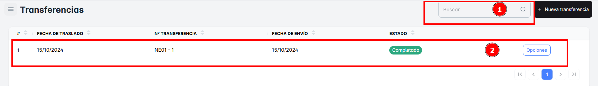
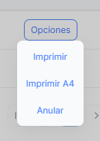
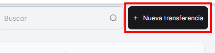
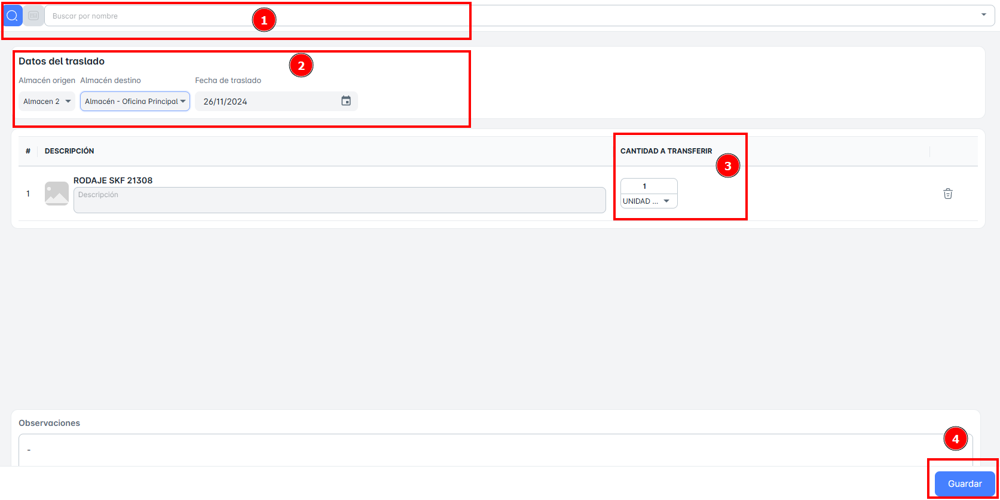

# Transferencias

En este módulo, podrás **ver todas las “Transferencias”** de productos realizadas mediante una **“Nota de Salida”,** al visualizar la primera vista de la ventana te aparecerán toda la lista de Transferencia**s**. Para buscar estas transferencias, podrás utilizar el **buscador** ubicado en la parte superior derecha de la pantalla.

Al ingresar el término de búsqueda correspondiente, podrás localizar fácilmente las transferencias o notas de salida específicas que necesitas consultar.

El Botón “**Opciones**” dispone de:

1. Imprimir
2. Imprimir A4
3. Anular

Para la **creación de una "Nueva Transferencia"**, sigue estos pasos detallados:

**Dar clic en el botón "Nueva Transferencia"**:

- Al hacer clic, se abrirá una nueva ventana en la que deberás ingresar la información correspondiente.

1. **Buscar el Producto**:
    - Puedes buscar el producto por **Nombre** o por su **código SKU**.
    - Alternativamente, también podrás seleccionar el producto de una lista desplegable.
2. **Datos del Traslado**:
    - Deberás completar los siguientes campos:
        - **Almacén de Origen**: Selecciona el almacén desde el cual se transferirá el producto.
        - **Almacén de Destino**: El almacén al que se enviará el producto.
        - **Fecha de Traslado**: La fecha en la que se realizará el traslado del producto.
3. **Cantidad a Transferir**:
    - Es necesario que indiques correctamente la cantidad de productos que se transferirán.
4. **Guardar**:
    - El paso final para completar la transferencia es hacer clic en el botón **"Guardar"**. Este paso es esencial para asegurar que la salida de productos se registre correctamente.

