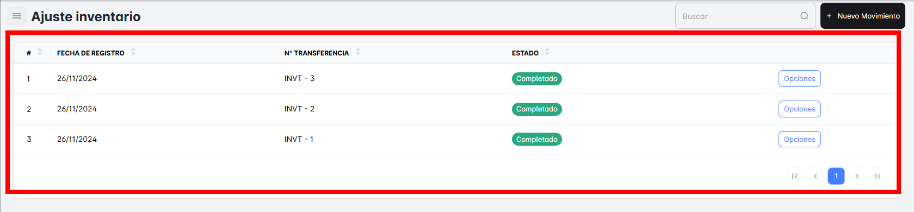
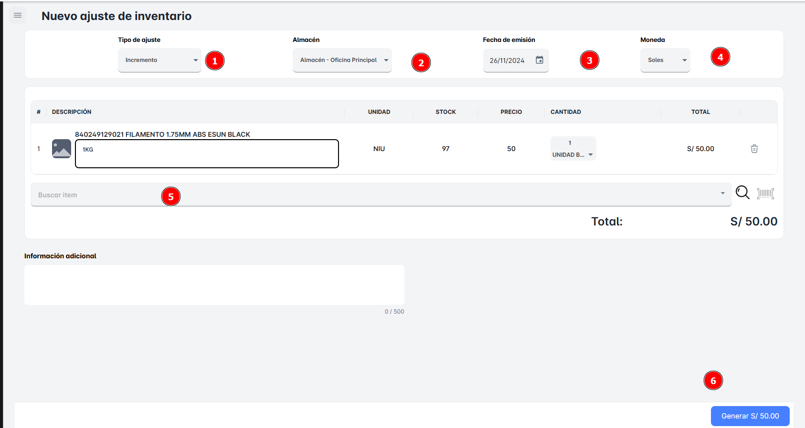

# Ajustes

## ¿Cómo realizar ‘Ajustes’ de Inventario?

En este módulo de **"Ajustes de Inventario"**, podrás realizar un **"Incremento"** o **"Disminución"** de los productos disponibles en cada **almacén. En la primera ventana podrás visualizar todos los ajustes realizados.**

**¿Cómo realizar un nuevo ajuste en Inventario?**

Si se realiza Click sobre el Botón de “**Nuevo Movimiento**”. Los pasos a seguir son los siguientes:

1. **Seleccionar el tipo de ajuste**:
    - Podrás elegir entre realizar un **incremento** o una **disminución** en la cantidad de productos disponibles en el almacén.
2. **Seleccionar la información relevante**:
    - **Fecha de Emisión**: Debes ingresar la fecha en la que se realiza el ajuste de inventario.
    - **Tipo de Moneda**: Selecciona la moneda correspondiente para el ajuste.
    - **Producto**: Elige el producto al que se le hará el ajuste. Puedes buscarlo en la lista desplegable o, si prefieres, buscarlo por **código SKU**.
3. **Ajustar la cantidad**:
    - Define si el ajuste será un incremento o disminución en la cantidad de productos disponibles. Asegúrate de ingresar la cantidad correctamente.
4. **Generar el ajuste**:
    - Finalmente, para completar el proceso, es necesario hacer clic en el botón **"Generar"**. Este paso registrará el **Nuevo Ajuste de Inventario** de manera definitiva.

