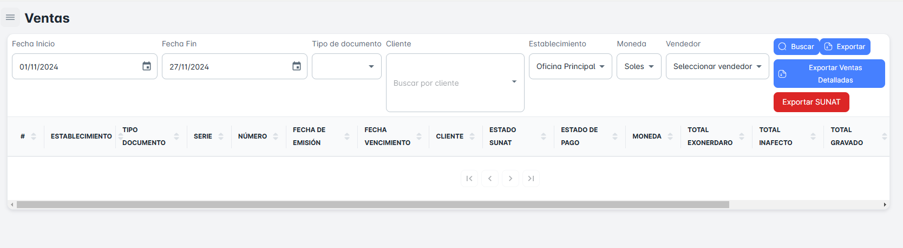
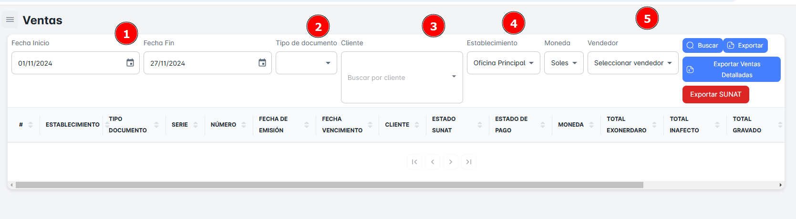
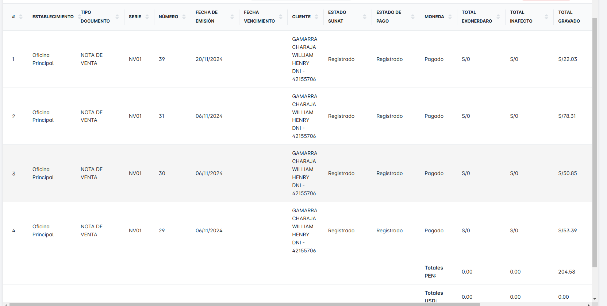
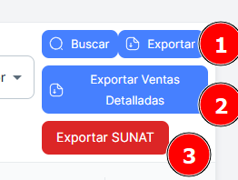

# Comprobantes Electronicos

En este módulo podrás realizar la búsqueda de **comprobantes electrónicos** según diversos criterios, como rango de fechas, tipo de documento, cliente, establecimiento y vendedor. Además, tendrás la opción de exportar reportes de ventas, tanto detallados como menos detallados.

## Buscar Comprobantes

Para realizar la búsqueda de comprobantes, sigue estos pasos:

1. **Selecciona un rango de fechas** (fecha de inicio y fecha de fin).
2. **Elige el tipo de documento**, el **cliente**, el **establecimiento** y el **vendedor**.
3. Haz clic en el botón **Buscar**.

Después de realizar estos pasos, recibirás un listado con los comprobantes que coincidan con los criterios seleccionados.

## Exportar Comprobantes de Ventas

Si deseas **exportar** (descargar) la base de datos de los comprobantes de ventas de tus clientes, sigue estos pasos:

1. **Selecciona los criterios** de búsqueda que deseas (como rango de fechas, tipo de documento, cliente, etc.).
2. Haz clic en el botón **Descargar**.

Si no seleccionas criterios específicos, al hacer clic en **Descargar**, obtendrás un archivo con la base de datos completa.

