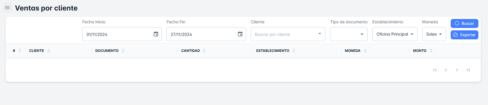
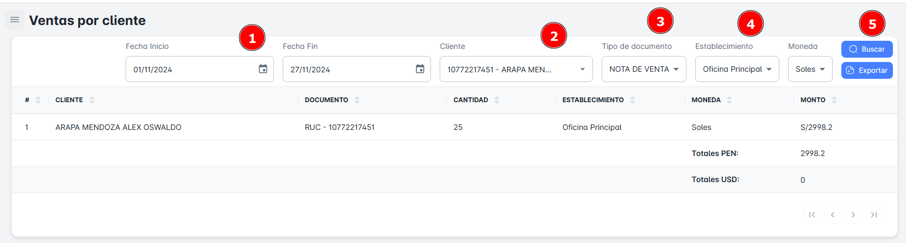
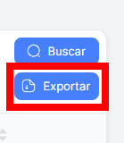

# Ventas por Cliente

En este módulo, podrás realizar la búsqueda de ventas por cliente utilizando diversos criterios, como rango de fechas, cliente, tipo de documento y establecimiento. Además, tendrás la opción de exportar reportes de ventas detallados por cliente.

## Buscar Ventas

Para realizar la **búsqueda de ventas por cliente** en tu empresa, sigue estos pasos:

1. **Selecciona un rango de fechas** (fecha de inicio y fecha de fin).
2. **Elige el cliente**, el **tipo de documento** y el **establecimiento**.
3. Haz clic en el botón **Buscar**.

Al hacerlo, recibirás un **resumen** con todos los registros de ventas por cliente según el rango de fechas seleccionado.

## Exportar Ventas del Cliente

Para **exportar** la base de datos en un archivo Excel, sigue estos pasos:

1. Haz clic en el **botón de exportar** ubicado en la parte superior derecha de la página.
2. Si has seleccionado criterios específicos de búsqueda, el archivo Excel contendrá solo los resultados correspondientes a ese cliente en particular.
3. Si solo seleccionas el **rango de fechas** como criterio, el archivo incluirá el **listado completo de clientes** dentro del rango de fechas seleccionado.

