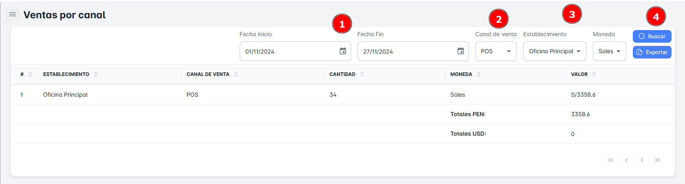
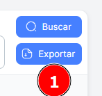

# Ventas por Canal

En este módulo, podrás realizar la **búsqueda de ventas por canal**, ya sea por **POS**, **Tienda virtual** o **Facturador de negocios**, utilizando diversos criterios como **rango de fechas**, **canal de venta** y **establecimiento**. Además, tendrás la opción de **exportar reportes detallados** de ventas por canal.

## Buscar Ventas por Canal

Para realizar la **búsqueda de ventas por canal** en tu empresa, sigue estos pasos:

1. **Selecciona un rango de fechas** (fecha de inicio y fecha de fin).
2. **Elige el canal de venta** y el **establecimiento**.
3. Haz clic en el botón **Buscar**.

Al hacerlo, recibirás un **resumen** con todos los registros de ventas por canal según el rango de fechas seleccionado.

## Exportar Ventas del Canal

Para **exportar** la base de datos en un archivo Excel, sigue estos pasos:

1. Haz clic en el **botón de exportar** ubicado en la parte superior derecha de la página.
2. Si has seleccionado criterios específicos de búsqueda, el archivo Excel contendrá solo los resultados correspondientes a ese canal de venta en particular.
3. Si solo seleccionas el **rango de fechas** como criterio, el archivo incluirá el **listado completo de canales** dentro del rango de fechas seleccionado.

