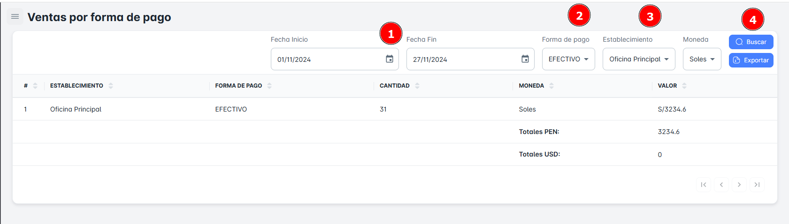

# Ventas por Forma de Pago

En este módulo, podrás realizar la **búsqueda de ventas por forma de pago**, ya sea por **efectivo**, **transferencia**, **tarjeta de débito o crédito**, **Yape**, **Plin**, entre otros. Podrás utilizar diversos criterios como **rango de fechas**, **forma de pago** y **establecimiento**. Además, tendrás la opción de **exportar reportes detallados** de ventas por forma de pago.

## Buscar Ventas por Forma de Pago

Para realizar la **búsqueda de ventas por forma de pago** en tu empresa, sigue estos pasos:

1. **Selecciona un rango de fechas** (fecha de inicio y fecha de fin).
2. **Elige formas de pago** y el **establecimiento**.
3. Haz clic en el botón **Buscar**.

Al hacerlo, recibirás un **resumen** con todos los registros de ventas por forma de pago según el rango de fechas seleccionado.

## Exportar Ventas por Forma de Pago

Para **exportar** la base de datos en un archivo Excel, sigue estos pasos:

1. Haz clic en el **botón de exportar** ubicado en la parte superior derecha de la página.
2. Si has seleccionado criterios específicos de búsqueda, el archivo Excel contendrá solo los resultados correspondientes a ese forma de pago en particular.
3. Si solo seleccionas el **rango de fechas** como criterio, el archivo incluirá el **listado completo de ventas por formas de pago** dentro del rango de fechas seleccionado.

