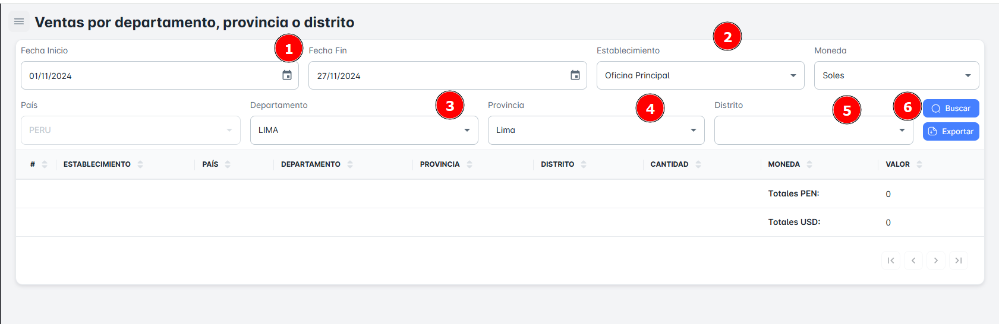

# Ventas por Departamento

En este módulo, podrás realizar la **búsqueda de ventas por departamento, sea que la sucursal de tu empresa este en Arequipa, Lima, Cuzco o entre otros departamentos**. Podrás utilizar diversos criterios como **rango de fechas**, **establecimiento, departamento, provincia y distrito**. Además, tendrás la opción de **exportar reportes detallados** de ventas por departamento.

## Buscar Ventas por Departamento

Para realizar la **búsqueda de ventas por departamento** en tu empresa, sigue estos pasos:

1. **Selecciona un rango de fechas** (fecha de inicio y fecha de fin).
2. **Elige** el **establecimiento y departamento (Si fuese el caso distrito)**.
3. Haz clic en el botón **Buscar**.

Al hacerlo, recibirás un **resumen** con todos los registros de ventas por departamento según el rango de fechas seleccionado.

## Exportar Ventas por Departamento

Para **exportar** la base de datos en un archivo Excel, sigue estos pasos:

1. Haz clic en el **botón de exportar** ubicado en la parte superior derecha de la página.
2. Si has seleccionado criterios específicos de búsqueda, el archivo Excel contendrá solo los resultados correspondientes a ese departamento en particular.
3. Si solo seleccionas el **rango de fechas** como criterio, el archivo incluirá el **listado completo de ventas por departamento** dentro del rango de fechas seleccionado.

