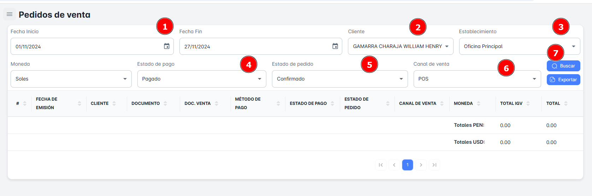

# Pedidos de Venta

En este módulo, podrás realizar la **búsqueda de pedidos de ventas** utilizando diversos criterios como **rango de fechas**, **cliente**, **establecimiento**, **estado de pago**, **estado del pedido** y **canal de venta**. Además, tendrás la opción de **exportar reportes detallados** de los pedidos de ventas.

## Buscar Pedido de Ventas

Para realizar la **búsqueda de pedido de ventas** en tu empresa, sigue estos pasos:

1. **Selecciona un rango de fechas** (fecha de inicio y fecha de fin).
2. **Elige** el cliente, **establecimiento, estado de pago, estado de pago, estado de pedido y canal de venta**
3. Haz clic en el botón **Buscar**.

Al hacerlo, recibirás un **resumen** con todos los registros de pedido de ventas según el rango de fechas seleccionado.

## Exportar Pedido de Ventas

Para **exportar** la base de datos en un archivo Excel, sigue estos pasos:

1. Haz clic en el **botón de exportar** ubicado en la parte superior derecha de la página.
2. Si has seleccionado criterios específicos de búsqueda, el archivo Excel contendrá solo los resultados correspondientes a ese pedido de ventas en particular.
3. Si solo seleccionas el **rango de fechas** como criterio, el archivo incluirá el **listado completo de pedidos de ventas** dentro del rango de fechas seleccionado.

