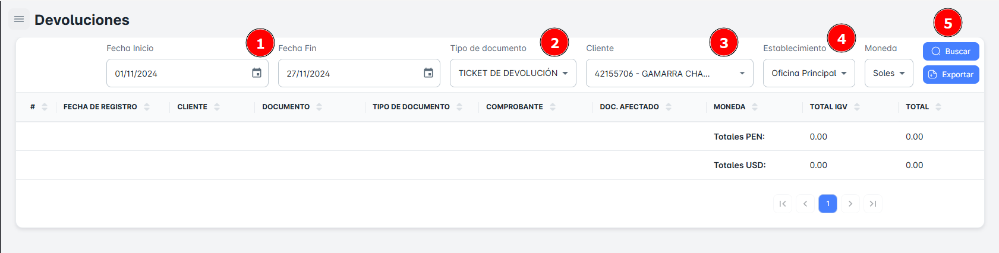

# Devoluciones

En este módulo, podrás realizar la **búsqueda de devoluciones** utilizando diversos criterios como **rango de fechas**, tipo de documento, **cliente y establecimiento**. Además, tendrás la opción de **exportar reportes detallados** de las devoluciones.

## Buscar Devoluciones

Para realizar la **búsqueda de devoluciones** en tu empresa, sigue estos pasos:

1. **Selecciona un rango de fechas** (fecha de inicio y fecha de fin).
2. **Elige** el tipo de documento, **cliente y establecimiento**
3. Haz clic en el botón **Buscar**.

Al hacerlo, recibirás un **resumen** con todos los registros de devoluciones según el rango de fechas seleccionado.

## Exportar Devoluciones

Para **exportar** la base de datos en un archivo Excel, sigue estos pasos:

1. Haz clic en el **botón de exportar** ubicado en la parte superior derecha de la página.
2. Si has seleccionado criterios específicos de búsqueda, el archivo Excel contendrá solo los resultados correspondientes a esas devoluciones en particular.
3. Si solo seleccionas el **rango de fechas** como criterio, el archivo incluirá el **listado completo de devoluciones** dentro del rango de fechas seleccionado.

