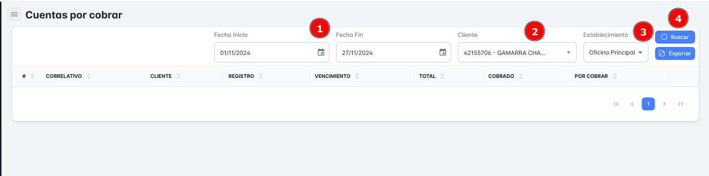

# Cuentas por Cobrar

En este módulo, podrás realizar la **búsqueda de devoluciones** utilizando diversos criterios como **rango de fechas**, **cliente y establecimiento**. Además, tendrás la opción de **exportar reportes detallados** de las cuentas por cobrar.

## Buscar Cuentas por Cobrar

Para realizar la **búsqueda de Cuentas por cobrar** en tu empresa, sigue estos pasos:

1. **Selecciona un rango de fechas** (fecha de inicio y fecha de fin).
2. **Elige** **cliente y establecimiento**
3. Haz clic en el botón **Buscar**.

Al hacerlo, recibirás un **resumen** con todos los registros de cuentas por cobrar según el rango de fechas seleccionado.

## Exportar Cuentas por Cobrar

Para **exportar** la base de datos en un archivo Excel, sigue estos pasos:

1. Haz clic en el **botón de exportar** ubicado en la parte superior derecha de la página.
2. Si has seleccionado criterios específicos de búsqueda, el archivo Excel contendrá solo los resultados correspondientes a esas cuentas por cobrar en particular.
3. Si solo seleccionas el **rango de fechas** como criterio, el archivo incluirá el **listado completo de cuentas por cobrar** dentro del rango de fechas seleccionado.

