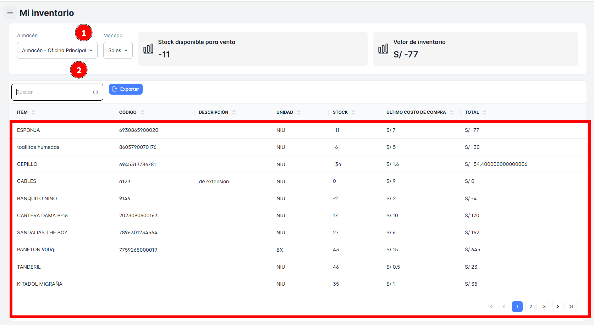
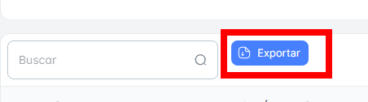

# Stock

En este módulo, podrás realizar la **búsqueda de los registros de tu inventario** utilizando diversos criterios, como un **ítem** de la tabla de **Stock**. Además, tendrás la opción de **exportar reportes detallados** de tu inventario (stock actual).

## Buscar Productos en mi Stock

Para realizar la búsqueda de un producto específico en el inventario, solo debes ingresar el **nombre del producto** en la barra de búsqueda ubicada en la parte superior izquierda de la página.

## Exportar Stock

Para **exportar** la base de datos en un archivo Excel, sigue estos pasos:

1. Haz clic en el **botón de exportar** ubicado en la parte superior izquierda de la página.
2. El archivo Excel contendrá solo los resultados correspondientes del stock de los productos en disponibles.

