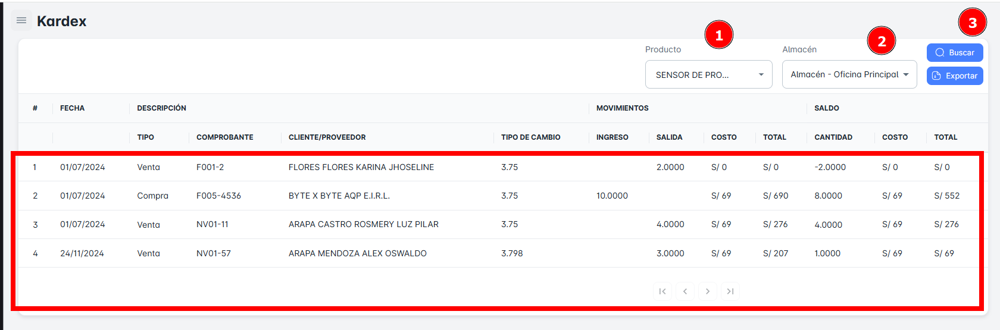
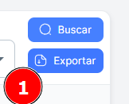

# Kardex

En este módulo, podrás realizar la **búsqueda de productos disponibles en tu Kardex** utilizando diversos criterios como **producto** y **almacén**. Además, tendrás la opción de **exportar reportes detallados** de los productos registrados en tu Kardex.

## Buscar Productos en mi Kardex

Para realizar la **búsqueda de productos en el Kardex** de tu empresa, sigue estos pasos:

1. **Selecciona el producto** y el **almacén**.
2. Haz clic en el botón **Buscar**.

Al hacerlo, recibirás un **resumen** con todos los registros de Kardex por productos.

## Exportar Kardex

Para **exportar** la base de datos en un archivo Excel, sigue estos pasos:

1. Haz clic en el **botón de exportar** ubicado en la parte superior derecha de la página.
2. Si has seleccionado criterios específicos de búsqueda, el archivo Excel contendrá solo los resultados correspondientes a los productos del Kardex seleccionados.

