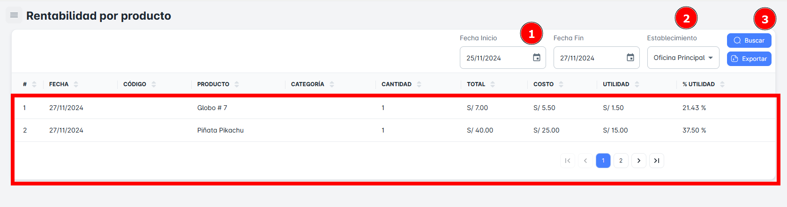
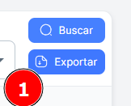

# Rentabilidad por Producto

En este módulo, podrás realizar la **búsqueda de Rentabilidad por producto** utilizando diversos criterios como **rango de fechas y establecimiento**. Además, tendrás la opción de **exportar reportes detallados** de la Rentabilidad por producto.

## Buscar Rentabilidad por Fechas

Para realizar la **búsqueda de Rentabilidad por producto** en tu empresa, sigue estos pasos:

1. **Selecciona un rango de fechas** (fecha de inicio y fecha de fin).
2. **Elige** **establecimiento.**
3. Haz clic en el botón **Buscar**.

Al hacerlo, recibirás un **resumen** con todos los registros de rentabilidad por productos según el rango de fechas seleccionado.

## Exportar Rentabilidad por Producto

Para **exportar** la base de datos en un archivo Excel, sigue estos pasos:

1. Haz clic en el **botón de exportar** ubicado en la parte superior derecha de la página.
2. Si has seleccionado criterios específicos de búsqueda, el archivo Excel contendrá solo los resultados correspondientes a la rentabilidad por productos en particular.
3. Si solo seleccionas el **rango de fechas** como criterio, el archivo incluirá el **listado completo de la rentabilidad por productos** dentro del rango de fechas seleccionado.

