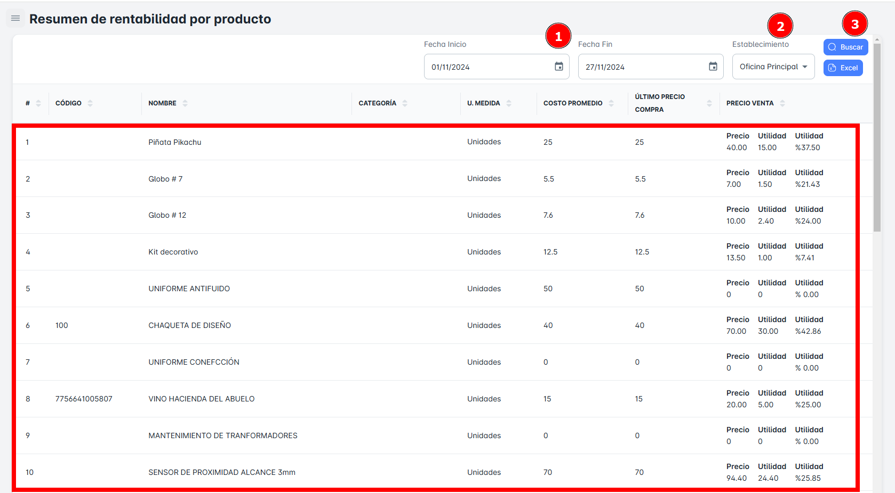
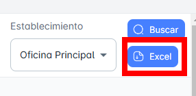

# Resumen de Rentabilidad por Producto

En este módulo, podrás realizar la **búsqueda de Resumen Rentabilidad por producto** utilizando diversos criterios como **rango de fechas y establecimiento**. Además, tendrás la opción de **exportar reportes detallados** del Resumen de Rentabilidad por producto.

## Buscar Resumen de Rentabilidad por Producto

Para realizar la **búsqueda de Resumen de Rentabilidad por producto** en tu empresa, sigue estos pasos:

1. **Selecciona un rango de fechas** (fecha de inicio y fecha de fin).
2. **Elige** **establecimiento.**
3. Haz clic en el botón **Buscar**.

Al hacerlo, recibirás un **resumen** con todos los registros del resumen de rentabilidad por productos según el rango de fechas seleccionado.

## Exportar Resumen de Rentabilidad por Producto

Para **exportar** la base de datos en un archivo Excel, sigue estos pasos:

1. Haz clic en el **botón de exportar** ubicado en la parte superior derecha de la página.
2. Si has seleccionado criterios específicos de búsqueda, el archivo Excel contendrá solo los resultados correspondientes al resumen de rentabilidad por productos en particular.
3. Si solo seleccionas el **rango de fechas** como criterio, el archivo incluirá el **listado completo del resumen de rentabilidad por productos** dentro del rango de fechas seleccionado.

