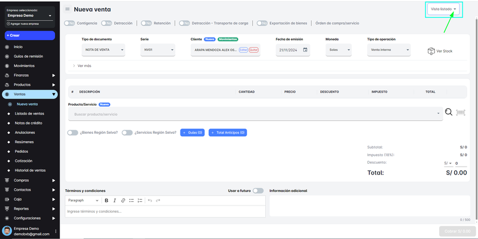
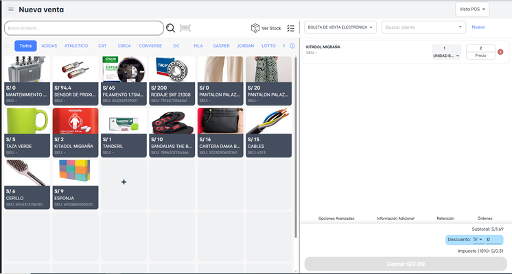

# ¿Cómo Realizar una Nueva Venta?

En este módulo, podrás realizar una **“Nueva Venta”**. Al ingresar a la sección de **"Nueva Venta"**, tendrás dos opciones de vista entre las cuales podrás elegir:

1. **POS (Punto de Venta)**:
    - Esta opción está diseñada para un proceso rápido de ventas, ideal para transacciones directas, como en una tienda física o punto de venta.
2. **Listado**:
    - En esta vista, podrás ver un listado detallado de productos, lo que permite una selección más organizada y una visión más clara de las ventas que estás realizando.

Vista de la modalidad '**Listado**'.

Vista de la modalidad '**POS**'.

# Crear una Nueva Venta

<video controls style="max-width: 100%; border: 1px solid #ddd; border-radius: 8px; padding: 4px;">
  <source src="/video/ventas/nuevaventa.mp4" type="video/mp4">
  Tu navegador no soporta el elemento de video.
</video>

## **Nueva Venta en Modalidad POS**

Para trabajar con la modalidad de vista 'POS', sigue los siguientes pasos:

1. **Seleccionar el Producto disponible**: Puedes elegir el producto directamente desde la lista visible o buscarlo por su código, si lo conoces, para encontrarlo rápidamente.
2. **Proceder con el cobro**: Una vez seleccionados los productos, haz clic en el botón **"Cobrar"** para continuar con el proceso de pago.
    - **Descuento opcional**: Antes de realizar el cobro, si lo deseas, puedes aplicar un descuento al total de la venta. Esta acción es opcional y se puede realizar según lo que corresponda a la transacción.andrea