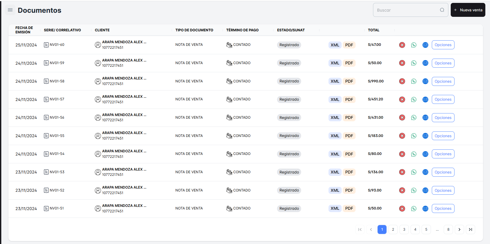
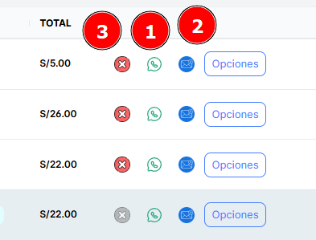
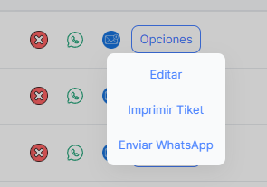
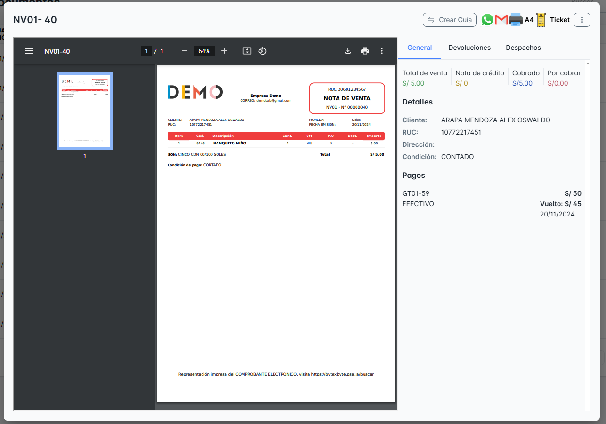

# Listado de Ventas

En este módulo podrás ver el Listado de Ventas realizadas hasta el momento en tu empresa. Aquí podrás consultar todas las transacciones realizadas, con acceso a detalles importantes de cada venta.
Podrás realizar la **búsqueda de una venta** de las siguientes maneras:

- **Por Nombre del Cliente**: Ingresando el nombre del cliente para encontrar todas las ventas asociadas a él.
- **Por Número de Documento**: Buscando según el número de documento emitido en la venta, lo que te permitirá encontrar rápidamente una venta específica si tienes este dato.

**Documentos de Listado de Ventas**.

### Opción de **enviar el "Documento Emitido"** de la venta.

1. **WhatsApp**: Puedes enviar el comprobante o documento directamente al número de WhatsApp del cliente.
2. **Correo Electrónico**: También tendrás la opción de enviar el documento por correo electrónico al cliente.

### Podrás **eliminar la venta** de tu listado

En caso de que haya algún error o se requiera eliminar la transacción por alguna razón. Esto te brinda flexibilidad para gestionar las ventas de manera eficiente.

### El **botón “Opciones”**

te ofrece varias funcionalidades para gestionar las ventas de manera más eficiente. Al hacer clic en este botón, tendrás las siguientes opciones:

- **Opción “Editar”**: Te permitirá modificar los detalles de la venta.
- **Opción “Imprimir Ticket”**: Esta opción te permitirá generar e imprimir un ticket de la venta.
- **Opción “Enviar WhatsApp”**: Podrás enviar el documento de la venta .

### Si deseas ver todos los detalles de la venta emitida.

Solo necesitas hacer clic sobre la venta en el listado. Al hacerlo, podrás visualizar toda la información relacionada con la transacción.

Tendrás la opción de visualizar los siguientes datos:

- **Generales**: Aquí podrás ver la información básica de la venta
- **Devoluciones**: En esta sección podrás consultar si la venta ha tenido alguna devolución asociada.
- **Despachos**: Esta opción te permitirá ver el estado del despacho o envío de los productos vendidos, como la fecha de envío, el número de seguimiento, y cualquier detalle relevante sobre la entrega.

**Detalle de Venta Emitida**.
