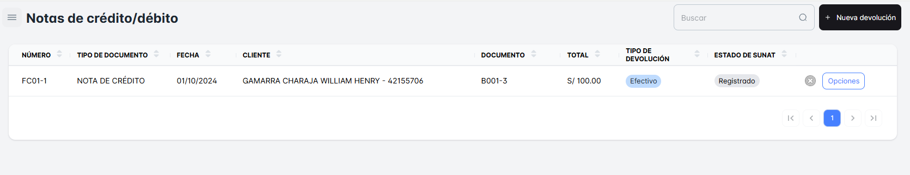
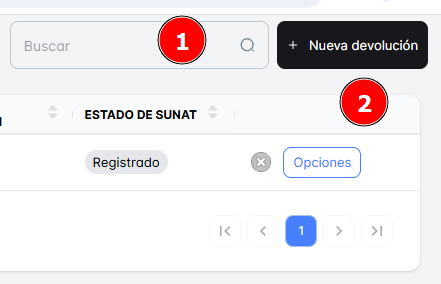
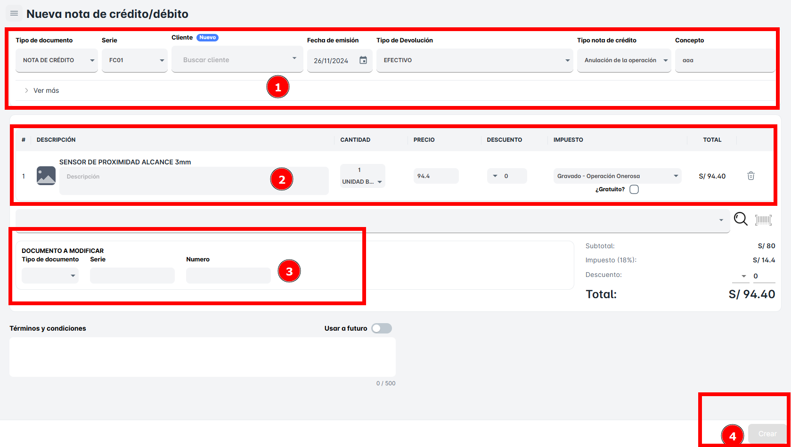

# Notas de Crédito

En este módulo de "Notas de Crédito", podrás visualizar todas las notas de crédito que se han realizado hasta el momento en tu empresa. Este módulo te ofrece un acceso rápido a un historial completo de las notas de crédito emitidas.

Podrás consultar detalles importantes de cada nota de crédito, como:

- **Fecha de emisión**
- **Cliente**
- **Monto de la nota de crédito**
- **Productos o servicios afectados**
- **Razón de la emisión** (por ejemplo, devoluciones, descuentos, ajustes en la venta, etc.)

**Notas de Credito Emitidas**.

### Podrás realizar la **búsqueda de una Nota de Crédito.**

- **Por Nombre del Cliente**: Ingresando el nombre del cliente, podrás encontrar todas las Notas de Crédito asociadas a él, facilitando la búsqueda de ajustes o devoluciones realizadas para ese cliente en particular.
- **Por Número de Documento**: Si tienes el número de documento de la Nota de Crédito.

Podrás realizar una "Nueva Devolución" de Nota de Crédito dando clic en el botón correspondiente. Al hacer esto, se abrirá la opción para crear una nueva devolución relacionada con la Nota de Crédito seleccionada.

### Pasos para **crear una nueva devolución**

1. **Selecciona el Cliente**.
2. **Elige la Fecha de Emisión**.
3. **Selecciona el Tipo de Devolución**.
4. **Selecciona el Tipo de Nota de Crédito**.
5. **Selecciona los Productos** a devolver.
6. **Selecciona los Documentos a Modificar**.
7. **Haz clic en "Crear"**.

Con estos pasos, podrás generar la devolución y emitir la Nota de Crédito correspondiente.

**Nueva Nota de Credito**.
