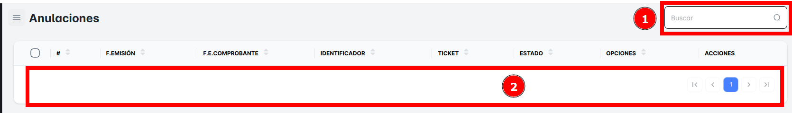

# Anulaciones

En este módulo, podrás realizar la **búsqueda de "Anulaciones"**. Aquí podrás visualizar todo el listado de anulaciones realizadas en tu empresa, lo que te permitirá consultar las transacciones que han sido canceladas o anuladas.

Podrás acceder a los siguientes detalles:

- **Fecha de la Anulación**.
- **Motivo de la Anulación**.
- **Documentos anulados**.
- **Cliente**

**Busqueda de una Anulacion**.
