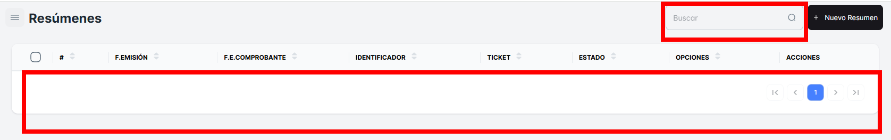
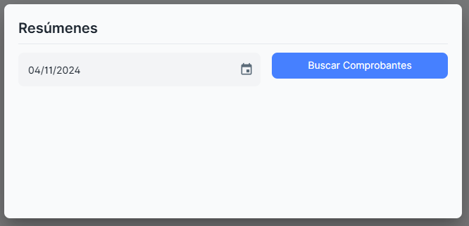

# Resúmenes

En este módulo, podrás realizar la **búsqueda de "Resúmenes"**. Aquí podrás visualizar todo el listado de resúmenes realizados en tu empresa, filtrados por fecha o criterios específicos.

Podrás acceder a los siguientes detalles:

- **Fecha de emisión del comprobante**: La fecha en la que se generó el resumen o comprobante.
- **Estado**: El estado del resumen, por ejemplo, si está pendiente, aprobado o anulado.
- **Otros detalles**: Dependiendo del sistema, podrías ver información adicional como el total, tipo de transacción, cliente asociado, entre otros.

**Busqueda de un Resumen**.

### Crear una **nueva búsqueda de resumen de los comprobantes**

Al dar clic sobre el botón **"Nuevo Resumen"**. Al hacerlo, se abrirá una **ventana emergente** donde podrás seleccionar la **fecha** para realizar la búsqueda del resumen correspondiente.

Este proceso te permitirá generar un nuevo resumen de comprobantes, filtrar por la fecha que elijas y consultar la información detallada de las transacciones realizadas en ese periodo.